# Comprehensive Integration Architecture for JobTrackerPro

**Document Number**: 2.4.6  
**Version**: 1.0.0  
**Created**: 2025-01-07  
**Status**: Active  
**Purpose**: Complete integration architecture showing how agents, scrapers, APIs, and MCP work together cohesively

## Executive Summary

This document presents JobTrackerPro's comprehensive integration architecture, demonstrating how AI agents, web scrapers, APIs, and Model Context Protocol (MCP) work together to create a seamless, intelligent job search experience for Swiss job seekers. The architecture prioritizes AI-First principles, scalability for 100K+ users, and fault tolerance while maintaining Swiss privacy compliance.

## Table of Contents

1. [System Architecture Overview](#1-system-architecture-overview)
2. [Event-Driven Agent Communication](#2-event-driven-agent-communication)
3. [Complete Data Flow Architecture](#3-complete-data-flow-architecture)
4. [Scalability Design for 100K+ Users](#4-scalability-design-for-100k-users)
5. [Fault Tolerance & Error Handling](#5-fault-tolerance--error-handling)
6. [Technology Stack & Justifications](#6-technology-stack--justifications)
7. [Implementation Roadmap](#7-implementation-roadmap)

---

## 1. System Architecture Overview

### 1.1 High-Level Architecture Diagram

```mermaid
graph TB
    subgraph "User Interface Layer"
        UI[Conversational AI Interface]
        Voice[Voice Interface]
        MCP_Client[MCP Client]
    end
    
    subgraph "AI Orchestration Layer"
        AIOrch[AI Orchestrator]
        Intent[Intent Recognition]
        Context[Context Manager]
        Memory[Long-term Memory]
    end
    
    subgraph "Integration Layer"
        EventBus[Event Bus]
        
        subgraph "MCP Servers"
            JobMCP[Job Search MCP]
            ResumeMCP[Resume MCP]
            CoachMCP[Career Coach MCP]
        end
        
        subgraph "API Integrations"
            JobRoomAPI[Job-Room API]
            LinkedInAPI[LinkedIn API]
            XingAPI[Xing API]
        end
        
        subgraph "Web Scrapers"
            JobsScraper[Jobs.ch Scraper]
            Scout24Scraper[JobScout24 Scraper]
            IndeedScraper[Indeed.ch Scraper]
        end
    end
    
    subgraph "Data Layer"
        VectorDB[(Vector Database)]
        Cache[(Redis Cache)]
        Queue[(Message Queue)]
        Analytics[(Analytics DB)]
    end
    
    subgraph "Agent Ecosystem"
        SearchAgent[Search Agent]
        MatchAgent[Matching Agent]
        AppAgent[Application Agent]
        CoachAgent[Coaching Agent]
    end
    
    UI --> AIOrch
    Voice --> AIOrch
    MCP_Client --> AIOrch
    
    AIOrch --> Intent
    AIOrch --> Context
    AIOrch --> Memory
    
    AIOrch --> EventBus
    
    EventBus --> JobMCP
    EventBus --> ResumeMCP
    EventBus --> CoachMCP
    EventBus --> JobRoomAPI
    EventBus --> LinkedInAPI
    EventBus --> XingAPI
    EventBus --> JobsScraper
    EventBus --> Scout24Scraper
    EventBus --> IndeedScraper
    
    EventBus --> SearchAgent
    EventBus --> MatchAgent
    EventBus --> AppAgent
    EventBus --> CoachAgent
    
    SearchAgent --> VectorDB
    MatchAgent --> VectorDB
    AppAgent --> Cache
    CoachAgent --> Analytics
    
    JobMCP --> Queue
    ResumeMCP --> Queue
    CoachMCP --> Queue
```



### 1.2 Component Responsibilities

#### AI Orchestration Layer
- **AI Orchestrator**: Central intelligence that coordinates all system components
- **Intent Recognition**: Understands user intent from natural language
- **Context Manager**: Maintains conversation state across sessions
- **Long-term Memory**: Stores user preferences and interaction history

#### Integration Layer
- **Event Bus**: Asynchronous message passing between components
- **MCP Servers**: Standardized protocol for all external integrations
- **API Integrations**: Direct connections to job board APIs
- **Web Scrapers**: Intelligent data extraction from websites without APIs

#### Agent Ecosystem
- **Search Agent**: Finds relevant job opportunities
- **Matching Agent**: Scores job-candidate compatibility
- **Application Agent**: Manages application process
- **Coaching Agent**: Provides career guidance

#### Data Layer
- **Vector Database**: Semantic search and similarity matching
- **Redis Cache**: High-performance caching for API responses
- **Message Queue**: Reliable message delivery between services
- **Analytics DB**: Usage patterns and performance metrics

---

## 2. Event-Driven Agent Communication

### 2.1 Event Bus Architecture

```python
class JobTrackerProEventBus:
    """
    Central event bus for all agent communication
    """
    
    def __init__(self):
        self.redis_client = Redis(decode_responses=True)
        self.pubsub = self.redis_client.pubsub()
        self.event_handlers = defaultdict(list)
        self.event_schema_registry = EventSchemaRegistry()
        
    async def publish(self, event_type: str, payload: Dict, priority: str = "normal"):
        """
        Publish event to all interested agents
        """
        # Validate event schema
        await self.event_schema_registry.validate(event_type, payload)
        
        # Add metadata
        event = {
            "id": str(uuid.uuid4()),
            "type": event_type,
            "timestamp": datetime.utcnow().isoformat(),
            "priority": priority,
            "payload": payload,
            "version": "1.0"
        }
        
        # Publish to Redis channel
        channel = f"jtp:events:{event_type}"
        await self.redis_client.publish(channel, json.dumps(event))
        
        # Store in event log for replay
        await self.store_event(event)
        
        return event["id"]
    
    async def subscribe(self, event_types: List[str], handler: Callable):
        """
        Subscribe agent to specific event types
        """
        for event_type in event_types:
            channel = f"jtp:events:{event_type}"
            await self.pubsub.subscribe(channel)
            self.event_handlers[event_type].append(handler)
        
        # Start listening
        asyncio.create_task(self._listen_for_events())
```

### 2.2 Agent Communication Patterns

```python
class AgentCommunicationPatterns:
    """
    Common communication patterns between agents
    """
    
    @staticmethod
    async def request_response(
        source_agent: str,
        target_agent: str,
        request: Dict,
        timeout: int = 30
    ) -> Dict:
        """
        Synchronous request-response pattern
        """
        correlation_id = str(uuid.uuid4())
        
        # Create response channel
        response_channel = f"jtp:response:{correlation_id}"
        
        # Send request
        await EventBus.publish(
            event_type=f"{target_agent}.request",
            payload={
                "correlation_id": correlation_id,
                "source": source_agent,
                "request": request,
                "response_channel": response_channel
            }
        )
        
        # Wait for response
        response = await EventBus.wait_for_response(
            response_channel,
            timeout=timeout
        )
        
        return response
    
    @staticmethod
    async def publish_subscribe(
        publisher_agent: str,
        event_type: str,
        data: Dict
    ):
        """
        Asynchronous publish-subscribe pattern
        """
        await EventBus.publish(
            event_type=f"{publisher_agent}.{event_type}",
            payload=data,
            priority="normal"
        )
    
    @staticmethod
    async def saga_pattern(
        orchestrator: str,
        steps: List[Dict]
    ) -> Dict:
        """
        Distributed transaction pattern for complex workflows
        """
        saga_id = str(uuid.uuid4())
        completed_steps = []
        
        try:
            for step in steps:
                result = await AgentCommunicationPatterns.request_response(
                    source_agent=orchestrator,
                    target_agent=step["agent"],
                    request=step["request"]
                )
                
                completed_steps.append({
                    "step": step,
                    "result": result
                })
                
                # Check if we should continue
                if not result.get("success", True):
                    raise SagaFailure(f"Step failed: {step['agent']}")
            
            return {"saga_id": saga_id, "status": "completed", "results": completed_steps}
            
        except Exception as e:
            # Compensate completed steps
            await AgentCommunicationPatterns._compensate_saga(
                saga_id,
                completed_steps
            )
            raise
```

### 2.3 Event Types and Contracts

```python
class EventTypes:
    """
    Standardized event types for agent communication
    """
    
    # Job Search Events
    JOB_SEARCH_REQUESTED = "job.search.requested"
    JOB_SEARCH_COMPLETED = "job.search.completed"
    JOB_FOUND = "job.found"
    JOB_UPDATED = "job.updated"
    
    # Application Events
    APPLICATION_STARTED = "application.started"
    APPLICATION_SUBMITTED = "application.submitted"
    APPLICATION_STATUS_CHANGED = "application.status.changed"
    
    # User Events
    USER_PREFERENCE_UPDATED = "user.preference.updated"
    USER_PROFILE_COMPLETED = "user.profile.completed"
    USER_GOAL_SET = "user.goal.set"
    
    # Agent Events
    AGENT_TASK_ASSIGNED = "agent.task.assigned"
    AGENT_TASK_COMPLETED = "agent.task.completed"
    AGENT_COLLABORATION_REQUESTED = "agent.collaboration.requested"

class EventSchemas:
    """
    Event schema definitions for validation
    """
    
    schemas = {
        EventTypes.JOB_SEARCH_REQUESTED: {
            "type": "object",
            "required": ["user_id", "query", "preferences"],
            "properties": {
                "user_id": {"type": "string"},
                "query": {"type": "string"},
                "preferences": {
                    "type": "object",
                    "properties": {
                        "locations": {"type": "array"},
                        "salary_range": {"type": "object"},
                        "job_types": {"type": "array"},
                        "languages": {"type": "array"}
                    }
                }
            }
        },
        # ... more schemas
    }
```

---

## 3. Complete Data Flow Architecture

### 3.1 Job Discovery to Application Flow

```python
class JobDiscoveryDataFlow:
    """
    Complete data flow from job discovery to application tracking
    """
    
    async def process_job_search_request(self, user_message: str) -> Dict:
        """
        End-to-end job search data flow
        """
        # Step 1: User Input Processing
        user_input = {
            "message": user_message,
            "timestamp": datetime.utcnow(),
            "user_id": self.user_id,
            "session_id": self.session_id
        }
        
        # Step 2: Intent Recognition
        intent = await self.ai_orchestrator.recognize_intent(user_input)
        await self.event_bus.publish(
            EventTypes.USER_INTENT_RECOGNIZED,
            {"intent": intent, "confidence": intent.confidence}
        )
        
        # Step 3: Context Enrichment
        context = await self.context_manager.enrich_context(
            user_id=self.user_id,
            intent=intent,
            historical_interactions=await self.get_user_history()
        )
        
        # Step 4: Search Strategy Planning
        search_plan = await self.search_agent.plan_search(
            intent=intent,
            context=context,
            available_sources=await self.discover_sources()
        )
        
        # Step 5: Parallel Data Collection
        raw_results = await self.execute_search_plan(search_plan)
        
        # Step 6: Data Normalization
        normalized_jobs = await self.normalize_job_data(raw_results)
        
        # Step 7: AI Matching & Ranking
        ranked_jobs = await self.matching_agent.rank_jobs(
            jobs=normalized_jobs,
            user_profile=context.user_profile,
            preferences=context.preferences
        )
        
        # Step 8: Result Enrichment
        enriched_results = await self.enrich_job_results(ranked_jobs)
        
        # Step 9: Response Generation
        response = await self.generate_conversational_response(
            jobs=enriched_results,
            context=context,
            style="encouraging"
        )
        
        # Step 10: Update User Context
        await self.update_user_context(
            search_performed=search_plan,
            results_shown=enriched_results
        )
        
        return response
```

### 3.2 Application Tracking Flow

```python
class ApplicationTrackingFlow:
    """
    Data flow for application tracking and management
    """
    
    async def track_application(self, application_data: Dict) -> Dict:
        """
        Complete application tracking flow
        """
        # Step 1: Extract Application Information
        application = await self.application_agent.extract_info(
            raw_data=application_data,
            source="user_input"
        )
        
        # Step 2: Create Application Record
        app_record = await self.create_application_record(application)
        
        # Step 3: Generate Embeddings for Semantic Search
        embeddings = await self.ai_engine.create_embeddings(
            text=f"{application.company} {application.position} {application.description}"
        )
        
        # Step 4: Store in Vector Database
        await self.vector_db.upsert(
            id=app_record.id,
            values=embeddings,
            metadata={
                "type": "application",
                "status": app_record.status,
                "company": app_record.company,
                "position": app_record.position,
                "user_id": self.user_id
            }
        )
        
        # Step 5: Set Up Intelligent Reminders
        reminders = await self.coaching_agent.plan_followup_strategy(
            application=app_record,
            company_patterns=await self.analyze_company_patterns(app_record.company)
        )
        
        # Step 6: Create Timeline Events
        for reminder in reminders:
            await self.event_bus.schedule(
                event_type=EventTypes.APPLICATION_FOLLOWUP_DUE,
                payload={"application_id": app_record.id, "action": reminder.action},
                schedule_time=reminder.due_date
            )
        
        # Step 7: Update Analytics
        await self.analytics.track_application(app_record)
        
        return {
            "application_id": app_record.id,
            "status": "tracked",
            "next_steps": reminders[0] if reminders else None
        }
```

### 3.3 Real-time Data Synchronization

```python
class RealTimeDataSync:
    """
    Real-time synchronization across all data sources
    """
    
    def __init__(self):
        self.sync_manager = DataSyncManager()
        self.conflict_resolver = ConflictResolver()
        self.change_detector = ChangeDetector()
        
    async def sync_job_data(self):
        """
        Continuous synchronization of job data
        """
        # Monitor all data sources
        monitors = [
            self.monitor_api_changes(),
            self.monitor_scraper_updates(),
            self.monitor_mcp_events(),
            self.monitor_user_updates()
        ]
        
        async for change_event in self.merge_change_streams(monitors):
            try:
                # Detect type of change
                change_type = await self.change_detector.classify(change_event)
                
                if change_type == "new_job":
                    await self.process_new_job(change_event)
                elif change_type == "job_update":
                    await self.process_job_update(change_event)
                elif change_type == "job_removed":
                    await self.process_job_removal(change_event)
                elif change_type == "conflict":
                    await self.resolve_conflict(change_event)
                    
            except Exception as e:
                await self.handle_sync_error(change_event, e)
    
    async def process_new_job(self, job_data: Dict):
        """
        Process newly discovered job
        """
        # Deduplicate
        if await self.is_duplicate(job_data):
            return
        
        # Normalize
        normalized = await self.normalizer.normalize(job_data)
        
        # Create embeddings
        embeddings = await self.ai_engine.create_job_embeddings(normalized)
        
        # Store
        await self.vector_db.insert(
            id=normalized.id,
            values=embeddings,
            metadata=normalized.to_dict()
        )
        
        # Notify interested agents
        await self.event_bus.publish(
            EventTypes.JOB_FOUND,
            {"job": normalized}
        )
        
        # Check for matching users
        matching_users = await self.find_matching_users(normalized)
        for user_id in matching_users:
            await self.notify_user(user_id, normalized)
```

---

## 4. Scalability Design for 100K+ Users

### 4.1 Horizontal Scaling Architecture

```python
class ScalableArchitecture:
    """
    Architecture designed for 100K+ concurrent users
    """
    
    def __init__(self):
        self.load_balancer = LoadBalancer(
            algorithm="weighted_round_robin",
            health_check_interval=5
        )
        
        self.auto_scaler = AutoScaler(
            min_instances=5,
            max_instances=100,
            target_cpu=70,
            target_memory=80
        )
        
        self.shard_manager = ShardManager(
            shard_count=16,
            replication_factor=3
        )
        
    async def handle_user_request(self, request: Dict) -> Dict:
        """
        Handle user request with automatic scaling
        """
        # Step 1: Route to appropriate shard
        shard = await self.shard_manager.get_shard(request["user_id"])
        
        # Step 2: Check if scale-up needed
        current_load = await self.monitor_load(shard)
        if current_load > 0.8:
            await self.auto_scaler.scale_up(shard)
        
        # Step 3: Get available instance
        instance = await self.load_balancer.get_instance(shard)
        
        # Step 4: Process request
        try:
            result = await instance.process(request)
            
            # Step 5: Update metrics
            await self.update_metrics(instance, success=True)
            
            return result
            
        except Exception as e:
            # Failover to another instance
            backup_instance = await self.load_balancer.get_backup_instance(shard)
            return await backup_instance.process(request)
```

### 4.2 Caching Strategy

```python
class MultiLevelCache:
    """
    Multi-level caching for high performance
    """
    
    def __init__(self):
        # L1: In-memory cache (fastest, smallest)
        self.l1_cache = LRUCache(max_size=1000)
        
        # L2: Redis cache (fast, medium size)
        self.l2_cache = RedisCache(
            max_memory="10GB",
            eviction_policy="allkeys-lru"
        )
        
        # L3: CDN cache (slower, largest)
        self.l3_cache = CDNCache(
            regions=["eu-central-1", "eu-west-1"],
            ttl=3600
        )
        
    async def get(self, key: str) -> Optional[Any]:
        """
        Get from cache with fallback
        """
        # Check L1
        if value := self.l1_cache.get(key):
            return value
        
        # Check L2
        if value := await self.l2_cache.get(key):
            self.l1_cache.put(key, value)  # Promote to L1
            return value
        
        # Check L3
        if value := await self.l3_cache.get(key):
            await self.l2_cache.set(key, value)  # Promote to L2
            self.l1_cache.put(key, value)  # Promote to L1
            return value
        
        return None
    
    async def set(self, key: str, value: Any, ttl: int = 3600):
        """
        Set in all cache levels
        """
        # Set in all levels with appropriate TTLs
        self.l1_cache.put(key, value, ttl=min(ttl, 300))  # Max 5 min in L1
        await self.l2_cache.set(key, value, ttl=ttl)
        await self.l3_cache.set(key, value, ttl=ttl * 2)  # Longer in CDN
```

### 4.3 Database Sharding

```python
class DatabaseSharding:
    """
    Sharding strategy for vector and traditional databases
    """
    
    def __init__(self):
        self.vector_shards = self._initialize_vector_shards()
        self.cache_shards = self._initialize_cache_shards()
        self.hash_function = ConsistentHash(virtual_nodes=150)
        
    async def get_vector_shard(self, user_id: str) -> VectorDBShard:
        """
        Get appropriate vector DB shard for user
        """
        shard_id = self.hash_function.get_node(user_id)
        return self.vector_shards[shard_id]
    
    async def query_vectors(self, user_id: str, query_vector: List[float], top_k: int = 10):
        """
        Query across sharded vector database
        """
        # Determine if we need cross-shard query
        if await self._is_global_query(query_vector):
            # Query all shards in parallel
            tasks = []
            for shard in self.vector_shards.values():
                tasks.append(shard.query(query_vector, top_k))
            
            all_results = await asyncio.gather(*tasks)
            
            # Merge and re-rank results
            merged = self._merge_results(all_results)
            return merged[:top_k]
        else:
            # Query single shard
            shard = await self.get_vector_shard(user_id)
            return await shard.query(query_vector, top_k)
    
    def _initialize_vector_shards(self) -> Dict[str, VectorDBShard]:
        """
        Initialize Pinecone shards
        """
        shards = {}
        for i in range(16):  # 16 shards
            shards[f"shard_{i}"] = VectorDBShard(
                index_name=f"jtp_vectors_shard_{i}",
                dimension=1536,
                metric="cosine",
                replicas=3
            )
        return shards
```

### 4.4 Message Queue Scaling

```python
class ScalableMessageQueue:
    """
    Scalable message queue implementation
    """
    
    def __init__(self):
        self.kafka_cluster = KafkaCluster(
            brokers=["broker1:9092", "broker2:9092", "broker3:9092"],
            replication_factor=3
        )
        
        self.partition_manager = PartitionManager(
            initial_partitions=32,
            auto_scale=True
        )
        
    async def publish(self, topic: str, message: Dict, key: str = None):
        """
        Publish message with automatic partitioning
        """
        # Determine partition
        if key:
            partition = self.partition_manager.get_partition(topic, key)
        else:
            partition = self.partition_manager.get_random_partition(topic)
        
        # Check if we need more partitions
        lag = await self.get_partition_lag(topic, partition)
        if lag > 10000:  # High lag threshold
            await self.partition_manager.add_partitions(topic, count=8)
        
        # Publish
        await self.kafka_cluster.send(
            topic=topic,
            value=json.dumps(message),
            key=key,
            partition=partition
        )
    
    async def consume(self, topics: List[str], group_id: str):
        """
        Consume messages with automatic rebalancing
        """
        consumer = self.kafka_cluster.consumer(
            topics=topics,
            group_id=group_id,
            enable_auto_commit=False,
            max_poll_records=100
        )
        
        async for message in consumer:
            try:
                yield json.loads(message.value)
                await consumer.commit_async()
            except Exception as e:
                await self.handle_message_error(message, e)
```

---

## 5. Fault Tolerance & Error Handling

### 5.1 Circuit Breaker Pattern

```python
class CircuitBreaker:
    """
    Circuit breaker for external service calls
    """
    
    def __init__(self, failure_threshold: int = 5, recovery_timeout: int = 60):
        self.failure_threshold = failure_threshold
        self.recovery_timeout = recovery_timeout
        self.failure_count = 0
        self.last_failure_time = None
        self.state = "closed"  # closed, open, half-open
        
    async def call(self, service_name: str, func: Callable, *args, **kwargs):
        """
        Execute function with circuit breaker protection
        """
        if self.state == "open":
            if await self._should_attempt_reset():
                self.state = "half-open"
            else:
                raise CircuitOpenError(f"Circuit breaker is open for {service_name}")
        
        try:
            result = await func(*args, **kwargs)
            await self._on_success()
            return result
            
        except Exception as e:
            await self._on_failure()
            raise
    
    async def _on_success(self):
        """
        Handle successful call
        """
        self.failure_count = 0
        if self.state == "half-open":
            self.state = "closed"
    
    async def _on_failure(self):
        """
        Handle failed call
        """
        self.failure_count += 1
        self.last_failure_time = datetime.utcnow()
        
        if self.failure_count >= self.failure_threshold:
            self.state = "open"
            await self._notify_circuit_open()
```

### 5.2 Retry Strategies

```python
class RetryStrategies:
    """
    Intelligent retry strategies for different failure types
    """
    
    @staticmethod
    async def exponential_backoff_retry(
        func: Callable,
        max_retries: int = 3,
        base_delay: float = 1.0,
        max_delay: float = 60.0,
        jitter: bool = True
    ):
        """
        Exponential backoff with jitter
        """
        for attempt in range(max_retries):
            try:
                return await func()
            except Exception as e:
                if attempt == max_retries - 1:
                    raise
                
                # Calculate delay
                delay = min(base_delay * (2 ** attempt), max_delay)
                
                # Add jitter to prevent thundering herd
                if jitter:
                    delay = delay * (0.5 + random.random() * 0.5)
                
                await asyncio.sleep(delay)
    
    @staticmethod
    async def adaptive_retry(
        func: Callable,
        error_classifier: Callable,
        max_retries: int = 5
    ):
        """
        Adaptive retry based on error type
        """
        for attempt in range(max_retries):
            try:
                return await func()
            except Exception as e:
                error_type = await error_classifier(e)
                
                if error_type == "transient":
                    # Quick retry for transient errors
                    await asyncio.sleep(0.1 * (attempt + 1))
                elif error_type == "rate_limit":
                    # Longer wait for rate limits
                    await asyncio.sleep(60)
                elif error_type == "server_error":
                    # Exponential backoff for server errors
                    await asyncio.sleep(2 ** attempt)
                else:
                    # Non-retryable error
                    raise
```

### 5.3 Graceful Degradation

```python
class GracefulDegradation:
    """
    Graceful degradation strategies when services fail
    """
    
    def __init__(self):
        self.fallback_providers = {}
        self.degradation_levels = ["full", "partial", "minimal", "offline"]
        self.current_level = "full"
        
    async def execute_with_degradation(
        self,
        primary_func: Callable,
        fallbacks: List[Callable],
        feature: str
    ):
        """
        Execute with graceful degradation
        """
        # Try primary function
        try:
            return await primary_func()
        except Exception as e:
            logger.warning(f"Primary function failed for {feature}: {e}")
        
        # Try fallbacks in order
        for i, fallback in enumerate(fallbacks):
            try:
                result = await fallback()
                
                # Notify about degradation
                await self.notify_degradation(
                    feature=feature,
                    level=i + 1,
                    total_levels=len(fallbacks)
                )
                
                return result
            except Exception as e:
                logger.warning(f"Fallback {i+1} failed for {feature}: {e}")
        
        # All fallbacks failed - return cached or default response
        return await self.get_offline_response(feature)
    
    async def get_offline_response(self, feature: str) -> Dict:
        """
        Get offline response when all services fail
        """
        offline_responses = {
            "job_search": {
                "status": "offline",
                "message": "Job search is temporarily unavailable. Here are some cached results from your last search.",
                "cached_results": await self.get_cached_jobs()
            },
            "application_tracking": {
                "status": "offline",
                "message": "Application tracking is offline. Your data is safe and will sync when we're back online.",
                "offline_mode": True
            }
        }
        
        return offline_responses.get(feature, {"status": "offline", "message": "Service temporarily unavailable"})
```

### 5.4 Error Recovery Workflows

```python
class ErrorRecoveryWorkflows:
    """
    Automated error recovery workflows
    """
    
    def __init__(self):
        self.recovery_strategies = {}
        self.incident_manager = IncidentManager()
        
    async def handle_system_error(self, error: Exception, context: Dict):
        """
        Comprehensive error handling workflow
        """
        # Step 1: Classify error
        error_classification = await self.classify_error(error)
        
        # Step 2: Log and track
        incident_id = await self.incident_manager.create_incident(
            error=error,
            classification=error_classification,
            context=context
        )
        
        # Step 3: Attempt automatic recovery
        if recovery_strategy := self.recovery_strategies.get(error_classification.type):
            try:
                await recovery_strategy.recover(error, context)
                await self.incident_manager.mark_resolved(incident_id, "auto_recovered")
                return
            except Exception as recovery_error:
                await self.incident_manager.add_note(
                    incident_id,
                    f"Recovery failed: {recovery_error}"
                )
        
        # Step 4: Escalate if needed
        if error_classification.severity == "critical":
            await self.escalate_to_oncall(incident_id)
        
        # Step 5: Notify affected users
        affected_users = await self.identify_affected_users(error, context)
        await self.notify_users(
            users=affected_users,
            message="We're experiencing temporary issues. Your data is safe and we're working on it."
        )
        
        # Step 6: Implement workaround if available
        if workaround := await self.find_workaround(error_classification):
            await self.apply_workaround(workaround, context)
```

---

## 6. Technology Stack & Justifications

### 6.1 Core AI Technologies

| Technology | Purpose | Justification |
|------------|---------|---------------|
| **OpenAI GPT-4** | Primary AI model | Best-in-class language understanding and generation |
| **LangChain** | AI orchestration | Mature framework for chaining AI operations |
| **Pinecone** | Vector database | High-performance, scalable vector search |
| **ChromaDB** | Local vector store | Development and edge deployments |

### 6.2 Integration Technologies

| Technology | Purpose | Justification |
|------------|---------|---------------|
| **Model Context Protocol (MCP)** | Universal integration protocol | Standardized, future-proof integration approach |
| **Playwright** | Web scraping | Handles modern JavaScript-heavy sites |
| **Redis** | Caching & pub/sub | Industry standard for high-performance caching |
| **Apache Kafka** | Message streaming | Proven scalability for event streaming |

### 6.3 Infrastructure Technologies

| Technology | Purpose | Justification |
|------------|---------|---------------|
| **Kubernetes** | Container orchestration | Industry standard for scalable deployments |
| **Istio** | Service mesh | Advanced traffic management and security |
| **Prometheus + Grafana** | Monitoring | Comprehensive metrics and visualization |
| **ElasticSearch** | Log aggregation | Powerful search and analytics for logs |

### 6.4 Data Technologies

| Technology | Purpose | Justification |
|------------|---------|---------------|
| **PostgreSQL** | Metadata storage | Reliable, ACID-compliant for critical data |
| **MongoDB** | Document storage | Flexible schema for varied job data |
| **MinIO** | Object storage | S3-compatible, self-hosted option |
| **Apache Parquet** | Analytics storage | Columnar format for efficient analytics |

### 6.5 Security Technologies

| Technology | Purpose | Justification |
|------------|---------|---------------|
| **HashiCorp Vault** | Secrets management | Enterprise-grade secrets handling |
| **OAuth 2.0 / OIDC** | Authentication | Industry standard for secure auth |
| **Envoy Proxy** | API gateway | High-performance, secure API routing |
| **Falco** | Runtime security | Container runtime threat detection |

---

## 7. Implementation Roadmap

### 7.1 Phase 1: Foundation (Weeks 1-2)

```yaml
Week 1:
  - Set up core infrastructure (Kubernetes, Redis, Kafka)
  - Implement event bus architecture
  - Create base agent framework
  - Set up monitoring and logging
  
Week 2:
  - Implement MCP client infrastructure
  - Create first MCP servers (job search, resume)
  - Set up vector database
  - Implement basic AI orchestration
```

### 7.2 Phase 2: Integration Layer (Weeks 3-4)

```yaml
Week 3:
  - Implement Job-Room API integration
  - Create web scrapers for major job boards
  - Set up data normalization pipeline
  - Implement caching strategy
  
Week 4:
  - Add LinkedIn and Xing integrations
  - Implement circuit breakers and retry logic
  - Create unified API interface
  - Set up rate limiting
```

### 7.3 Phase 3: AI Agents (Weeks 5-6)

```yaml
Week 5:
  - Implement Search Agent
  - Create Matching Agent
  - Build Application Agent
  - Develop Coaching Agent
  
Week 6:
  - Implement agent communication patterns
  - Create saga workflows
  - Add context management
  - Implement learning loops
```

### 7.4 Phase 4: Scalability (Weeks 7-8)

```yaml
Week 7:
  - Implement database sharding
  - Set up auto-scaling
  - Create load balancing
  - Optimize caching layers
  
Week 8:
  - Performance testing with 100K+ users
  - Implement graceful degradation
  - Add comprehensive error handling
  - Stress test all components
```

### 7.5 Phase 5: Production Readiness (Weeks 9-10)

```yaml
Week 9:
  - Security audit and hardening
  - Implement comprehensive monitoring
  - Create operational runbooks
  - Set up disaster recovery
  
Week 10:
  - Final integration testing
  - Performance optimization
  - Documentation completion
  - Production deployment
```

## Key Success Metrics

1. **Performance Metrics**
   - API latency: < 200ms (p99)
   - Job search response: < 2s
   - System availability: 99.9%
   - Concurrent users: 100K+

2. **Data Quality Metrics**
   - Job deduplication: 99%+
   - Data normalization accuracy: 95%+
   - Match relevance: 85%+

3. **User Experience Metrics**
   - Conversation success rate: 90%+
   - Job match satisfaction: 80%+
   - Application tracking accuracy: 99%+

4. **Operational Metrics**
   - Auto-scaling response: < 30s
   - Error recovery rate: 95%+
   - Circuit breaker effectiveness: 99%+

## Conclusion

This comprehensive integration architecture provides JobTrackerPro with a robust, scalable foundation that seamlessly combines AI agents, web scrapers, APIs, and MCP into a cohesive system. The event-driven architecture ensures loose coupling and high scalability, while the fault tolerance mechanisms guarantee reliability even under extreme load.

The architecture is designed to handle 100K+ concurrent users while maintaining sub-second response times and 99.9% availability. By following AI-First principles throughout, the system can intelligently adapt to user needs, learn from interactions, and continuously improve its job matching capabilities.

The phased implementation roadmap ensures that each component is properly tested and integrated before moving to the next phase, reducing risk and ensuring a smooth path to production deployment.