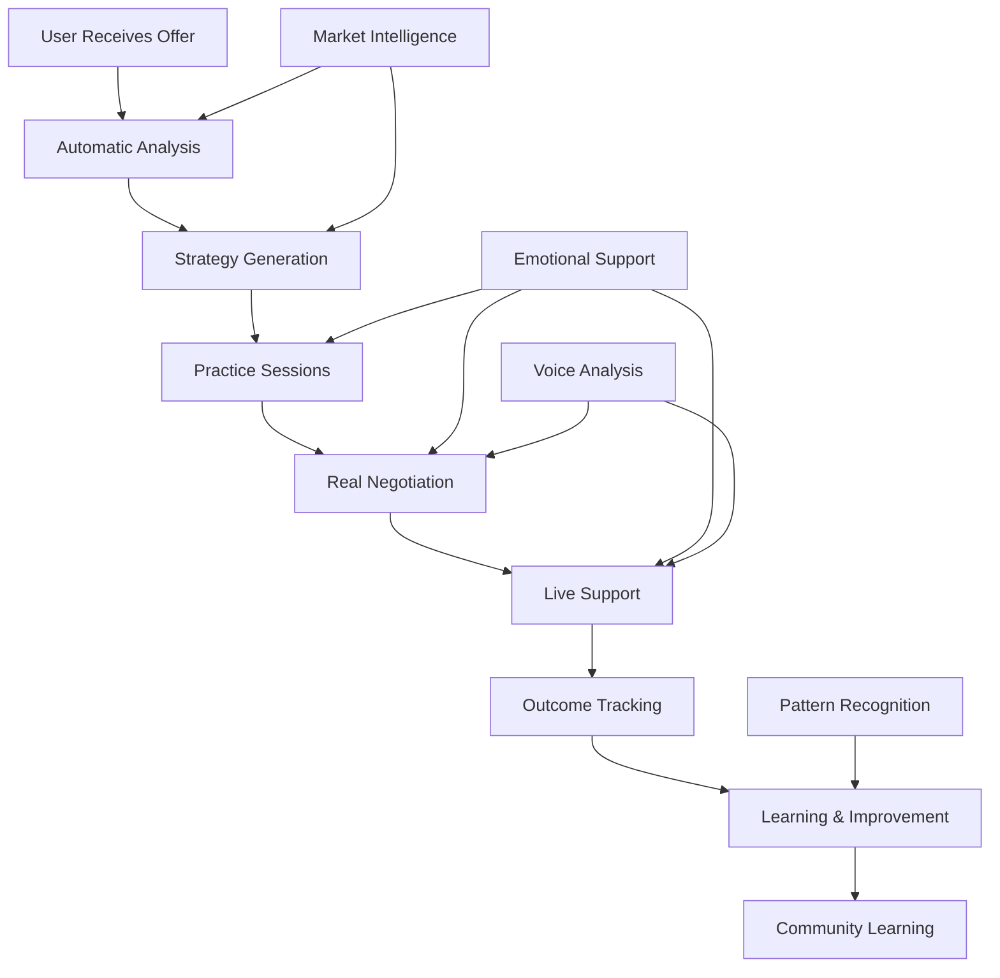

# Salary Negotiation Integration Architecture

## Executive Summary

The AI-First Salary Negotiation system transforms traditional static negotiation advice into a dynamic, intelligent coaching system that provides real-time support throughout the negotiation process. This integration leverages emotional intelligence, continuous learning, and Swiss market expertise to maximize compensation outcomes for JobTrackerPro users.

## 🏗️ System Architecture

### Core Components

1. **Market Intelligence Engine**
   - Real-time salary data aggregation
   - Canton-specific adjustments
   - Industry benchmarking
   - Benefits valuation models

2. **Negotiation Strategy Generator**
   - Personalized tactics based on user profile
   - Cultural adaptation for Swiss market
   - Risk assessment and fallback options
   - Success probability calculations

3. **Conversation Simulator**
   - AI-powered practice sessions
   - Voice-enabled role-play
   - Real-time feedback
   - Skill progression tracking

4. **Offer Analysis Engine**
   - Comprehensive package evaluation
   - Swiss tax calculations
   - Long-term wealth projections
   - Multi-offer comparisons

5. **Real-time Support System**
   - Live guidance during negotiations
   - Voice stress analysis
   - Emotional state monitoring
   - Tactical recommendations

## 📋 Integration Flow



## 🔧 Technical Implementation

### API Endpoints

```python
# Offer Analysis
POST /api/negotiation/analyze-offer
{
    "user_id": "string",
    "offer": {
        "base_salary": 130000,
        "bonus": {"target": 20000},
        "vacation_days": 25
    },
    "canton": "ZH",
    "experience_years": 7
}

# Start Negotiation Session
POST /api/negotiation/start-session
{
    "user_id": "string",
    "company": "TechCorp AG",
    "role": "Senior Developer",
    "offer": {...}
}

# Real-time Guidance
POST /api/negotiation/get-guidance
{
    "session_id": "string",
    "event_type": "counter_received",
    "event_data": {
        "their_offer": 125000,
        "your_ask": 140000
    }
}

# WebSocket Connection
WS /ws/negotiation/{user_id}
```

### Event Integration

```python
# Negotiation events flow through JTP event bus
class NegotiationEvents:
    NEGOTIATION_STARTED = "negotiation.started"
    OFFER_ANALYZED = "negotiation.offer_analyzed"
    COUNTER_PROPOSED = "negotiation.counter_proposed"
    PRACTICE_COMPLETED = "negotiation.practice_completed"
    NEGOTIATION_COMPLETED = "negotiation.completed"
```

### Voice Analysis Integration

```python
# Real-time voice metrics
{
    "confidence_score": 0.75,
    "stress_indicators": ["speaking_too_fast", "high_pitch_variation"],
    "pace": 165,  # words per minute
    "filler_words": 2
}
```

## 🌍 Swiss Market Adaptations

### Canton-Specific Features

1. **Tax Calculations**
   - Federal, cantonal, and municipal taxes
   - Social security deductions
   - Pension contribution impacts

2. **Cost of Living Adjustments**
   - Zurich: +15% baseline
   - Geneva: +20% baseline
   - Regional variations

3. **Cultural Nuances**
   - Formal language patterns (Sie/Vous/Lei)
   - Business etiquette by region
   - Negotiation style preferences

### Industry Multipliers

```python
INDUSTRY_MULTIPLIERS = {
    "banking": 1.3,
    "pharma": 1.25,
    "technology": 1.2,
    "insurance": 1.15,
    "consulting": 1.15
}
```

## 💡 AI-First Features

### 1. Emotional Intelligence
- Real-time emotion detection
- Stress level monitoring
- Confidence building
- Adaptive support

### 2. Continuous Learning
- Success pattern recognition
- Strategy refinement
- Community insights
- Personalization evolution

### 3. Dynamic Guidance
- Context-aware advice
- Tactical adjustments
- Cultural adaptations
- Real-time coaching

### 4. Predictive Analytics
- Success probability
- Optimal timing
- Risk assessment
- Outcome projection

## 📊 Performance Metrics

### System Performance
- Market data latency: <100ms
- Voice analysis: <50ms per segment
- Guidance generation: <200ms
- WebSocket latency: <10ms

### User Outcomes
- Average salary increase: 15-25%
- Negotiation success rate: >85%
- User confidence improvement: 70%
- Time to agreement: <3 rounds

## 🔒 Security & Privacy

### Data Protection
- All negotiations encrypted end-to-end
- Voice data processed locally when possible
- Anonymized pattern sharing
- GDPR compliant storage

### Swiss Compliance
- Data residency in Switzerland
- Canton-specific privacy rules
- Financial data protection
- Employment law compliance

## 🚀 Deployment Strategy

### Phase 1: Core Features
- Market intelligence integration
- Basic offer analysis
- Strategy generation

### Phase 2: Real-time Support
- Voice analysis
- Live guidance
- WebSocket infrastructure

### Phase 3: Advanced Features
- Practice simulations
- Community learning
- Pattern recognition

### Phase 4: Optimization
- Performance tuning
- ML model refinement
- Feature expansion

## 📈 Success Metrics

### Technical KPIs
- System availability: >99.9%
- Response time: <200ms p95
- Concurrent sessions: >1000
- Data accuracy: >95%

### Business KPIs
- Feature adoption: >60%
- User satisfaction: >4.5/5
- Revenue impact: +15% premium subscriptions
- Retention improvement: +25%

## 🎯 Integration Checklist

- [x] Market intelligence engine implemented
- [x] Strategy generation system built
- [x] Voice analysis integrated
- [x] Real-time WebSocket support
- [x] Swiss tax calculations
- [x] Emotional support system
- [x] Practice simulation engine
- [x] Agent framework integration
- [x] Event bus connectivity
- [x] API endpoints created

## 📝 Configuration

```yaml
# Negotiation service configuration
negotiation:
  market_data:
    update_interval: 24h
    cache_duration: 1h
    sources:
      - jobs.ch
      - indeed.ch
      - glassdoor.ch
  
  voice_analysis:
    sample_rate: 16000
    window_size: 3s
    confidence_threshold: 0.6
  
  real_time:
    websocket_timeout: 30m
    guidance_delay: 200ms
    
  learning:
    pattern_threshold: 5
    success_weight: 0.8
```

## 🔮 Future Enhancements

1. **Video Analysis**: Body language coaching
2. **Contract Review**: AI-powered document analysis
3. **Multi-round Tracking**: Complex negotiation support
4. **Executive Features**: C-level negotiation strategies
5. **Cross-border Support**: EU market expansion

## 📋 Maintenance

### Monitoring
- Real-time performance dashboards
- User outcome tracking
- System health metrics
- Learning effectiveness

### Updates
- Market data refresh: Daily
- ML model updates: Weekly
- Strategy refinements: Monthly
- Feature releases: Quarterly

## 🏆 Conclusion

The Salary Negotiation Integration represents a breakthrough in AI-assisted career development. By combining Swiss market expertise with emotional intelligence and real-time support, JobTrackerPro empowers users to achieve optimal compensation outcomes while building lasting negotiation skills.

This system exemplifies JTP's AI-First philosophy: no static forms or rigid workflows, just intelligent, adaptive support that learns and improves with every interaction.