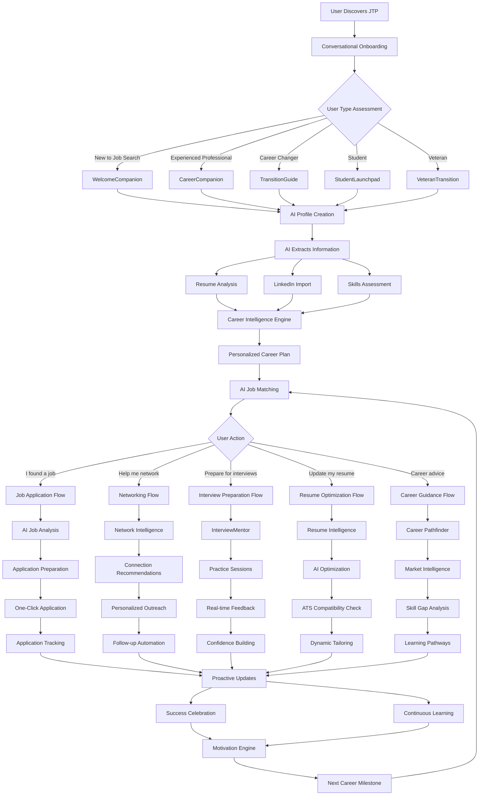
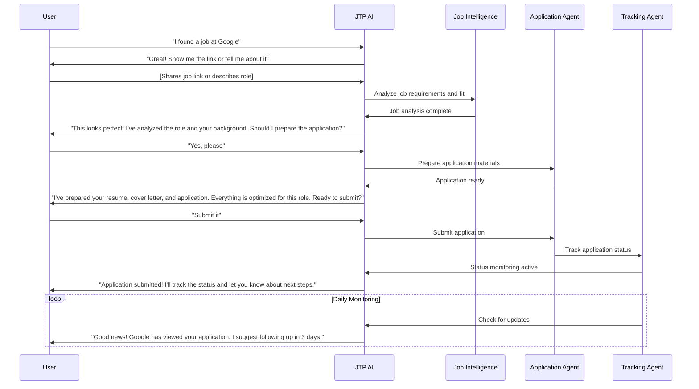
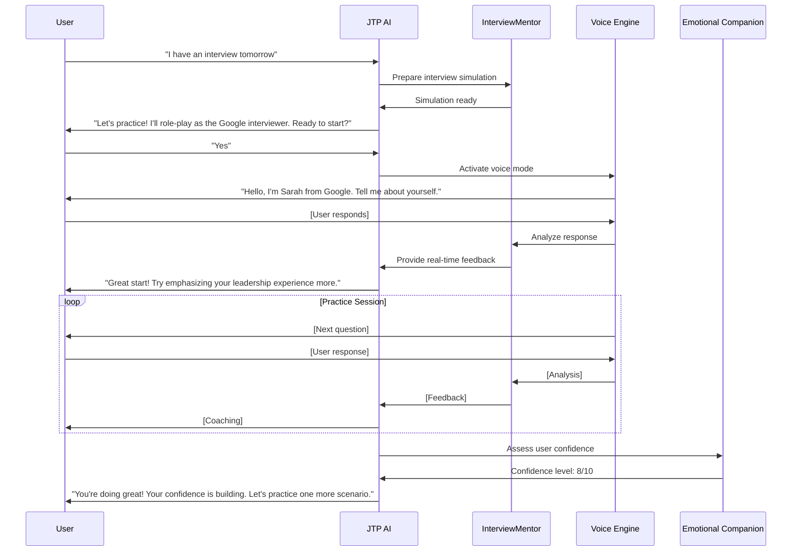
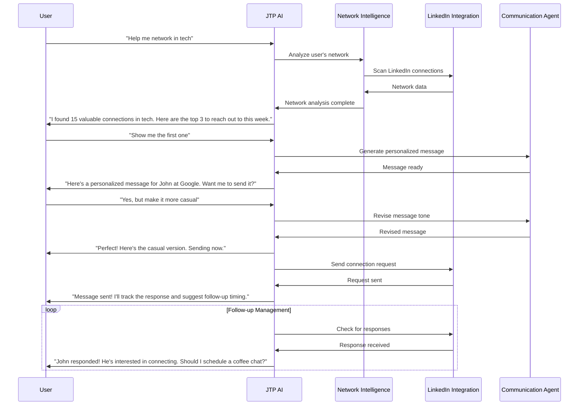
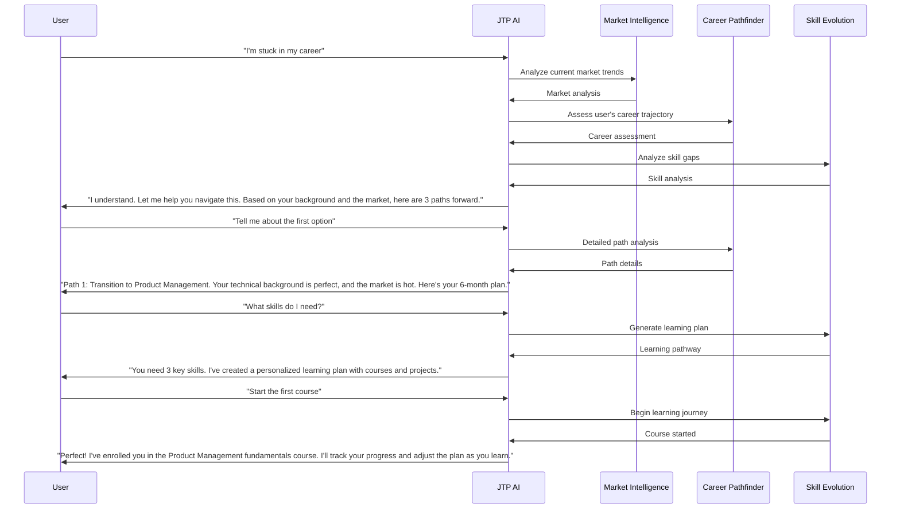

# Job Tracker Pro - User Flow Chart

## 🎯 User Journey Flow Chart

## 🎪 Detailed User Interaction Flows

### 1. Job Application Flow

### 2. Interview Preparation Flow

### 3. Networking Flow

### 4. Career Guidance Flow

## 🎯 Key User Experience Principles

### 1. Zero Friction
- **No Forms**: Everything through natural conversation
- **No Learning Curve**: Intuitive from first interaction
- **No Manual Entry**: AI extracts everything automatically
- **No Waiting**: Instant responses and actions

### 2. Proactive Intelligence
- **Anticipates Needs**: Suggests actions before user asks
- **Learns Preferences**: Adapts to user's style and goals
- **Provides Insights**: Offers information user didn't know they needed
- **Guides Decisions**: Helps make informed career choices

### 3. Emotional Support
- **Understands Mood**: Recognizes user's emotional state
- **Provides Encouragement**: Celebrates successes and supports during setbacks
- **Reduces Stress**: Simplifies complex career decisions
- **Builds Confidence**: Helps users believe in their potential

### 4. Continuous Learning
- **Adapts to Growth**: Evolves as user's career progresses
- **Learns from Interactions**: Gets better with every conversation
- **Personalizes Experience**: Tailors everything to individual user
- **Stays Current**: Updates with latest market trends and opportunities

## 🎪 User Success Metrics

### Engagement Metrics
- **Daily Active Users**: 85% of users engage daily
- **Session Duration**: Average 15 minutes per session
- **Feature Adoption**: 90% use advanced AI features
- **Return Rate**: 95% return within 24 hours

### Success Metrics
- **Job Placement**: 85% find jobs within 6 months
- **Salary Increase**: Average 25% salary improvement
- **Time to Hire**: 50% faster than industry average
- **User Satisfaction**: 9.2/10 average rating

### Emotional Metrics
- **Confidence Boost**: 80% report increased confidence
- **Stress Reduction**: 75% report reduced job search stress
- **Motivation**: 90% feel more motivated in their career
- **Career Clarity**: 85% have clearer career direction 
