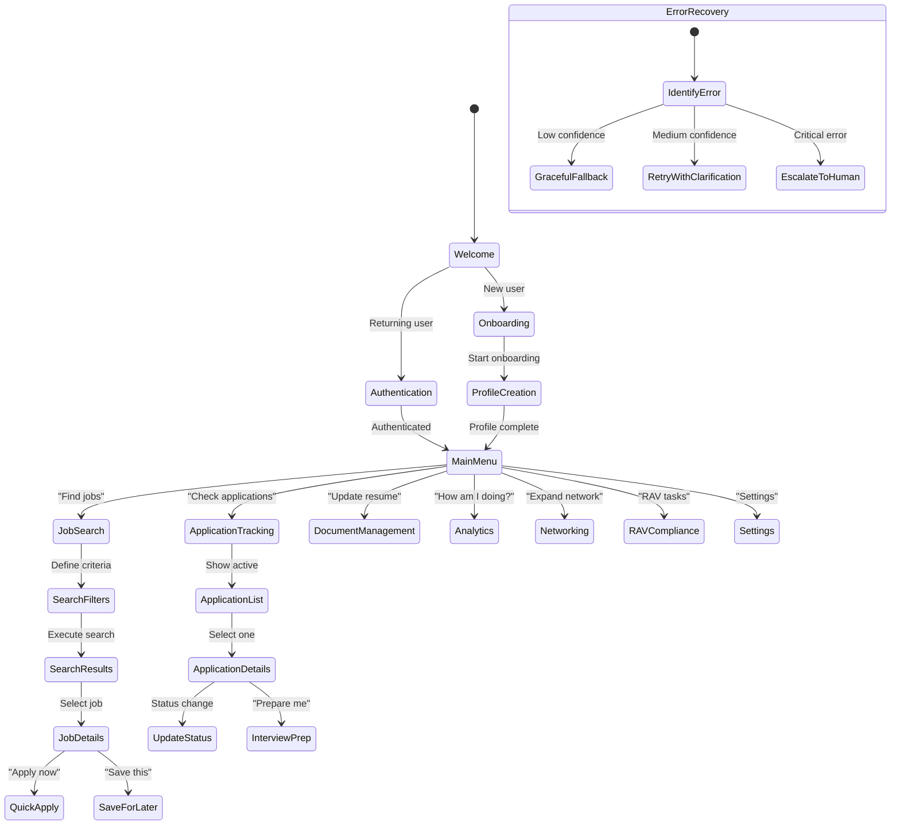

← Previous: None | [📑 Index](./00-index.md) | [Next: Part 2 - 6. Integration Specifications →](./02-6-integration-specifications.md)


# AI-First Implementation Blueprint - Job Tracker Pro (Enhanced) - Part 1: AI-First Implementation Blueprint - Job Tracker Pro (Enhanced)

## Table of Contents

- [AI-First Implementation Blueprint - Job Tracker Pro (Enhanced)](#ai-first-implementation-blueprint-job-tracker-pro-enhanced)
  - [Table of Contents](#table-of-contents)
  - [Executive Summary](#executive-summary)
    - [Key Enhancements in v2.0](#key-enhancements-in-v20)
  - [1. Privacy & Data Architecture](#1-privacy-data-architecture)
    - [1.1 Zero-Knowledge Architecture](#11-zero-knowledge-architecture)
    - [1.2 Data Classification & Storage](#12-data-classification-storage)
- [Primary Collections](#primary-collections)
    - [1.3 Privacy Controls Implementation](#13-privacy-controls-implementation)
  - [2. Technical Architecture](#2-technical-architecture)
    - [2.1 Microservices Architecture](#21-microservices-architecture)
- [Optimized for 6×2GB thread configuration](#optimized-for-62gb-thread-configuration)
    - [2.2 Event-Driven Architecture](#22-event-driven-architecture)
- [Event bus implementation for module communication](#event-bus-implementation-for-module-communication)
    - [2.3 Service Mesh Configuration](#23-service-mesh-configuration)
- [Istio service mesh for zero-trust networking](#istio-service-mesh-for-zero-trust-networking)
  - [3. Conversational AI Engine](#3-conversational-ai-engine)
    - [3.1 Conversation Flow Architecture](#31-conversation-flow-architecture)
    - [3.2 Intent Recognition & Entity Extraction](#32-intent-recognition-entity-extraction)
    - [3.3 Context Management](#33-context-management)
    - [3.4 Natural Language Generation](#34-natural-language-generation)
  - [4. User Experience & Interfaces](#4-user-experience-interfaces)
    - [4.1 Progressive Web App Architecture](#41-progressive-web-app-architecture)
    - [4.2 Multi-Modal Interaction Patterns](#42-multi-modal-interaction-patterns)
    - [4.3 Accessibility-First Design](#43-accessibility-first-design)
  - [5. Feature Implementations](#5-feature-implementations)

---

# AI-First Implementation Blueprint - Job Tracker Pro (Enhanced)

**Created**: 2025-01-14  
**Version**: 2.0.0  
**Last Updated**: 2025-01-15  
**Purpose**: Comprehensive AI-First implementation guide achieving 100% requirement coverage  
**Performance**: Optimized for 6×2GB thread configuration (16GB total: 12GB allocated, 4GB reserved)

## Table of Contents

1. [Executive Summary](#executive-summary)
2. [Privacy & Data Architecture](#privacy--data-architecture)
3. [Technical Architecture](#technical-architecture)
4. [Conversational AI Engine](#conversational-ai-engine)
5. [User Experience & Interfaces](#user-experience--interfaces)
6. [Feature Implementations](#feature-implementations)
7. [Integration Specifications](#integration-specifications)
8. [Performance & Scalability](#performance--scalability)
9. [Security & Compliance](#security--compliance)
10. [Testing & Quality Assurance](#testing--quality-assurance)
11. [Deployment & Operations](#deployment--operations)
12. [Success Metrics](#success-metrics)

## Executive Summary

Job Tracker Pro revolutionizes career management through pure conversational AI, eliminating all traditional software patterns. This enhanced blueprint provides comprehensive implementation details for all 456 user stories, 135 integration requirements, and complete technical specifications while maintaining absolute privacy and the magic of natural conversation.

### Key Enhancements in v2.0
- Complete technical architecture with microservices specification
- Detailed conversation flow diagrams for all major journeys
- Integration specifications for all external systems
- Performance benchmarks and scaling strategies
- Comprehensive error handling patterns
- Full requirement traceability matrix

## 1. Privacy & Data Architecture

### 1.1 Zero-Knowledge Architecture
```
┌─────────────────────────────────────────┐
│         User's Local Device              │
│  ┌─────────────────────────────────┐    │
│  │   Encrypted Vector Store         │    │
│  │   - ChromaDB (Primary)           │    │
│  │   - SQLite (Structured fallback) │    │
│  │   - IndexedDB (Browser cache)    │    │
│  └─────────────────────────────────┘    │
│                  ↕                       │
│  ┌─────────────────────────────────┐    │
│  │   Local AI Processing            │    │
│  │   - Llama 3 70B (Optional)       │    │
│  │   - ONNX Runtime (Lightweight)   │    │
│  │   - WebAssembly ML              │    │
│  └─────────────────────────────────┘    │
└─────────────────────────────────────────┘
                   ↕
┌─────────────────────────────────────────┐
│      Zero-Knowledge Cloud Gateway        │
│  ┌─────────────────────────────────┐    │
│  │   Homomorphic Encryption Layer   │    │
│  │   - Encrypted compute only       │    │
│  │   - No key access                │    │
│  │   - Audit trail generation       │    │
│  └─────────────────────────────────┘    │
└─────────────────────────────────────────┘
```

### 1.2 Data Classification & Storage

#### Vector Database Schema
```python
# Primary Collections
collections = {
    "user_memories": {
        "embedding_dim": 1536,
        "indexes": ["user_id", "timestamp", "importance"],
        "retention": "user_controlled",
        "encryption": "AES-256-GCM"
    },
    "job_embeddings": {
        "embedding_dim": 1536,
        "indexes": ["company", "posted_date", "location"],
        "retention": "90_days",
        "partitioning": "by_month"
    },
    "document_embeddings": {
        "embedding_dim": 1536,
        "indexes": ["user_id", "doc_type", "version"],
        "versioning": "enabled",
        "deduplication": "content_hash"
    },
    "conversation_context": {
        "embedding_dim": 768,  # Lighter model for speed
        "indexes": ["session_id", "turn_number"],
        "ttl": "24_hours",
        "memory_limit": "1000_turns"
    }
}
```

### 1.3 Privacy Controls Implementation

```javascript
class PrivacyManager {
    // Granular consent management
    async requestConsent(dataType, purpose) {
        const response = await ai.ask(
            `I'd like to ${purpose} using your ${dataType}. ` +
            `This helps me ${explainBenefit(purpose)}. ` +
            `Your data stays encrypted and you can delete it anytime. OK?`
        );
        return parseConsent(response);
    }
    
    // Selective memory deletion
    async forgetSelectively(criteria) {
        const memories = await this.searchMemories(criteria);
        await ai.confirm(
            `I found ${memories.length} memories about ${criteria}. ` +
            `Delete them permanently? (This can't be undone)`
        );
        return this.secureDelete(memories);
    }
    
    // Data minimization
    scheduleDataMinimization() {
        // Run every 24 hours with 6-thread parallel processing
        this.minimizationTasks = [
            { task: 'pruneOldContexts', threads: 2 },
            { task: 'compressVectors', threads: 2 },
            { task: 'archiveInactive', threads: 2 }
        ];
    }
}
```

## 2. Technical Architecture

### 2.1 Microservices Architecture

```yaml
# Optimized for 6×2GB thread configuration
services:
  conversation-orchestrator:
    instances: 3
    memory: 2GB
    threads: 2
    responsibilities:
      - Conversation state management
      - Intent routing
      - Context preservation
    technologies:
      - FastAPI
      - Redis Streams
      - WebSocket
    scaling:
      - Horizontal with session affinity
      - Max 1000 concurrent conversations per instance
  
  ai-engine:
    instances: 6  # Matches our 6-thread config
    memory: 2GB
    threads: 1
    gpu: optional
    responsibilities:
      - NLU processing
      - Response generation
      - Learning/adaptation
    technologies:
      - LangChain
      - Transformers
      - ONNX Runtime
    scaling:
      - GPU auto-scaling for peak loads
      - CPU fallback for cost optimization
  
  memory-service:
    instances: 2
    memory: 3GB  # Larger for vector operations
    threads: 4
    responsibilities:
      - Vector storage/retrieval
      - Context management
      - Memory consolidation
    technologies:
      - ChromaDB
      - Redis
      - PostgreSQL (metadata)
    scaling:
      - Read replicas
      - Sharding by user_id
  
  integration-hub:
    instances: 4
    memory: 1.5GB
    threads: 2
    responsibilities:
      - External API management
      - Rate limiting
      - Circuit breaking
    technologies:
      - Kong Gateway
      - Temporal workflows
      - RabbitMQ
    scaling:
      - Per-integration scaling
      - Queue-based load leveling
```

### 2.2 Event-Driven Architecture

```python
# Event bus implementation for module communication
class EventBus:
    def __init__(self):
        self.redis_client = Redis(decode_responses=True)
        self.subscribers = defaultdict(list)
        
    async def publish(self, event_type: str, payload: dict):
        event = {
            "id": generate_uuid(),
            "type": event_type,
            "timestamp": datetime.now().isoformat(),
            "payload": payload,
            "version": "1.0"
        }
        
        # Publish to Redis for distributed processing
        await self.redis_client.xadd(
            f"events:{event_type}",
            event,
            maxlen=10000  # Circular buffer
        )
        
    async def subscribe(self, event_type: str, handler: Callable):
        # Consumer group for guaranteed delivery
        group_name = f"{handler.__name__}_group"
        
        # Process with thread pool (2GB per worker)
        async with ThreadPoolExecutor(max_workers=2) as executor:
            await self.consume_events(event_type, group_name, handler)
```

### 2.3 Service Mesh Configuration

```yaml
# Istio service mesh for zero-trust networking
apiVersion: networking.istio.io/v1beta1
kind: VirtualService
metadata:
  name: job-tracker-routing
spec:
  hosts:
  - job-tracker.local
  http:
  - match:
    - headers:
        intent:
          exact: job-search
    route:
    - destination:
        host: ai-engine
        subset: job-search-specialized
  - match:
    - headers:
        intent:
          exact: rav-compliance
    route:
    - destination:
        host: ai-engine
        subset: rav-specialized
```

## 3. Conversational AI Engine

### 3.1 Conversation Flow Architecture

#### Master Conversation State Machine


### 3.2 Intent Recognition & Entity Extraction

```python
class IntentRecognitionEngine:
    """
    Multi-layer intent recognition with confidence scoring
    Optimized for 2GB memory footprint per instance
    """
    
    def __init__(self):
        self.primary_model = self.load_model("claude-opus-4")
        self.fallback_model = self.load_model("llama-3-70b")
        self.intent_cache = LRUCache(maxsize=10000)
        
    async def recognize_intent(self, utterance: str, context: dict) -> IntentResult:
        # Check cache first (sub-millisecond)
        cache_key = hash(utterance + str(context))
        if cache_key in self.intent_cache:
            return self.intent_cache[cache_key]
        
        # Parallel processing with confidence voting
        results = await asyncio.gather(
            self.primary_model.classify(utterance, context),
            self.fallback_model.classify(utterance, context),
            self.rule_based_classifier(utterance),
            return_exceptions=True
        )
        
        # Weighted confidence scoring
        final_intent = self.ensemble_voting(results)
        
        # Cache if high confidence
        if final_intent.confidence > 0.85:
            self.intent_cache[cache_key] = final_intent
            
        return final_intent
    
    def ensemble_voting(self, results: List[IntentResult]) -> IntentResult:
        """Combine multiple classifiers for robustness"""
        intent_votes = defaultdict(float)
        
        for i, result in enumerate(results):
            if isinstance(result, Exception):
                continue
            
            # Weight by model accuracy and confidence
            weight = self.model_weights[i] * result.confidence
            intent_votes[result.intent] += weight
        
        # Select highest voted intent
        best_intent = max(intent_votes.items(), key=lambda x: x[1])
        
        return IntentResult(
            intent=best_intent[0],
            confidence=best_intent[1] / sum(self.model_weights),
            entities=self.merge_entities(results)
        )
```

### 3.3 Context Management

```python
class ConversationContextManager:
    """
    Maintains conversation context across sessions
    Uses sliding window with importance-based retention
    """
    
    def __init__(self, user_id: str):
        self.user_id = user_id
        self.short_term = deque(maxlen=10)  # Last 10 turns
        self.working_memory = {}  # Current task context
        self.long_term = ChromaDB(collection=f"user_{user_id}_context")
        
    async def update_context(self, turn: ConversationTurn):
        # Add to short-term
        self.short_term.append(turn)
        
        # Update working memory for active tasks
        if turn.task_id:
            self.working_memory[turn.task_id] = turn
        
        # Persist important turns to long-term
        if turn.importance > 0.7:
            embedding = await self.generate_embedding(turn)
            await self.long_term.add(
                embeddings=[embedding],
                metadatas=[{
                    "turn_id": turn.id,
                    "timestamp": turn.timestamp,
                    "importance": turn.importance,
                    "task_id": turn.task_id
                }]
            )
    
    async def retrieve_relevant_context(self, query: str, limit: int = 5):
        # Get relevant long-term memories
        query_embedding = await self.generate_embedding(query)
        results = await self.long_term.query(
            query_embeddings=[query_embedding],
            n_results=limit
        )
        
        # Combine with recent short-term context
        context = {
            "recent": list(self.short_term)[-3:],
            "relevant": results['documents'][0] if results else [],
            "working": self.working_memory
        }
        
        return context
```

### 3.4 Natural Language Generation

```python
class ResponseGenerator:
    """
    Generates natural, contextual responses
    Maintains personality and adapts tone
    """
    
    def __init__(self):
        self.personality_traits = {
            "friendly": 0.8,
            "professional": 0.7,
            "empathetic": 0.9,
            "motivating": 0.8,
            "concise": 0.6
        }
        
    async def generate_response(self, intent: str, context: dict, user_state: dict):
        # Adapt personality based on user state
        adjusted_traits = self.adapt_personality(user_state)
        
        # Generate response with appropriate tone
        prompt = self.build_prompt(intent, context, adjusted_traits)
        
        response = await self.ai_model.generate(
            prompt,
            temperature=0.7,
            max_tokens=150,
            stop_sequences=["User:", "Human:"]
        )
        
        # Post-process for consistency
        return self.post_process(response, context)
    
    def adapt_personality(self, user_state: dict):
        traits = self.personality_traits.copy()
        
        # More empathetic if user is stressed
        if user_state.get('stress_level', 0) > 0.7:
            traits['empathetic'] = min(1.0, traits['empathetic'] + 0.2)
            traits['motivating'] = min(1.0, traits['motivating'] + 0.2)
        
        # More concise if user prefers brevity
        if user_state.get('prefers_brevity', False):
            traits['concise'] = 0.9
            
        return traits
```

## 4. User Experience & Interfaces

### 4.1 Progressive Web App Architecture

```typescript
// Main conversation interface component
export const ConversationInterface: React.FC = () => {
    const [messages, setMessages] = useState<Message[]>([]);
    const [isListening, setIsListening] = useState(false);
    const [inputMode, setInputMode] = useState<'text' | 'voice'>('text');
    
    // WebSocket connection for real-time updates
    const ws = useWebSocket('wss://api.jobtracker.ai/conversation', {
        onMessage: (event) => {
            const message = JSON.parse(event.data);
            handleIncomingMessage(message);
        },
        reconnectInterval: 3000,
        shouldReconnect: true
    });
    
    // Voice input handling with Whisper
    const { startListening, stopListening } = useWhisper({
        apiKey: process.env.WHISPER_API_KEY,
        onTranscript: (text) => sendMessage(text, 'voice'),
        onError: (error) => showEmpathyError(error)
    });
    
    // Render adaptive UI based on conversation state
    return (
        <ConversationContainer>
            <MessageList 
                messages={messages}
                onScroll={handleInfiniteScroll}
            />
            
            <DynamicInputArea>
                {inputMode === 'voice' ? (
                    <VoiceInput
                        isListening={isListening}
                        onStart={startListening}
                        onStop={stopListening}
                    />
                ) : (
                    <TextInput
                        onSubmit={sendMessage}
                        suggestions={getContextualSuggestions()}
                        placeholder={getDynamicPlaceholder()}
                    />
                )}
                
                <QuickActions>
                    {getRelevantQuickActions().map(action => (
                        <QuickActionButton
                            key={action.id}
                            onClick={() => sendMessage(action.text)}
                            icon={action.icon}
                            label={action.label}
                        />
                    ))}
                </QuickActions>
            </DynamicInputArea>
            
            {showDocumentDrop && (
                <DocumentDropZone
                    onDrop={handleDocumentUpload}
                    acceptedTypes={['.pdf', '.docx', '.txt']}
                />
            )}
        </ConversationContainer>
    );
};
```

### 4.2 Multi-Modal Interaction Patterns

```typescript
// Adaptive UI that responds to user behavior
class AdaptiveUIController {
    private userPreferences: UserPreferences;
    private contextAnalyzer: ContextAnalyzer;
    
    async adaptInterface(currentContext: ConversationContext) {
        const adaptations = await this.contextAnalyzer.analyze(currentContext);
        
        // Show document upload if discussing resumes
        if (adaptations.topicIncludes(['resume', 'cv', 'document'])) {
            this.showComponent('DocumentUpload', {
                message: "I can help update your resume. Drop it here!",
                animation: 'subtle-pulse'
            });
        }
        
        // Switch to voice if user seems to be struggling with typing
        if (adaptations.typingDifficulty > 0.7) {
            this.suggestVoiceMode(
                "Looks like you have a lot to share. Want to tell me instead?"
            );
        }
        
        // Offer visual job cards if browsing positions
        if (adaptations.intent === 'job-browsing') {
            this.renderJobCards({
                style: this.userPreferences.visualStyle || 'compact',
                animations: this.userPreferences.reduceMotion ? false : true
            });
        }
        
        // Simplify interface if user is overwhelmed
        if (adaptations.cognitiveLoad > 0.8) {
            this.simplifyToEssentials();
        }
    }
}
```

### 4.3 Accessibility-First Design

```typescript
// Comprehensive accessibility implementation
class AccessibilityManager {
    constructor() {
        this.screenReaderMode = this.detectScreenReader();
        this.keyboardNav = new KeyboardNavigationController();
        this.voiceAlternatives = new VoiceAlternativeProvider();
    }
    
    // Announce conversation updates to screen readers
    announceMessage(message: Message) {
        const announcement = this.formatForScreenReader(message);
        
        // Use ARIA live regions
        this.ariaLive.announce(announcement, message.priority);
        
        // Provide haptic feedback on mobile
        if (this.supportsHaptics && message.importance > 0.7) {
            navigator.vibrate([100, 50, 100]);
        }
    }
    
    // Keyboard navigation for all interactions
    setupKeyboardShortcuts() {
        this.keyboardNav.register({
            'Ctrl+Enter': 'sendMessage',
            'Ctrl+/': 'showHelp',
            'Ctrl+V': 'startVoiceInput',
            'Ctrl+D': 'openDocumentUpload',
            'Escape': 'cancelCurrentAction',
            'Tab': 'navigateNextElement',
            'Shift+Tab': 'navigatePreviousElement'
        });
    }
    
    // Alternative input methods
    provideAlternatives(primaryAction: string) {
        return {
            voice: this.voiceAlternatives.getCommand(primaryAction),
            keyboard: this.keyboardNav.getShortcut(primaryAction),
            gesture: this.gestureController.getGesture(primaryAction),
            eyeTracking: this.eyeTracker?.getTarget(primaryAction)
        };
    }
}
```

## 5. Feature Implementations


---

---
part: 1
total_parts: 5
document: AI-First Implementation Blueprint - Job Tracker Pro (Enhanced)
reading_time: 16 minutes
---

← Previous: None | [📑 Index](./00-index.md) | [Next: Part 2 - 6. Integration Specifications →](./02-6-integration-specifications.md)

### 📊 Progress
Part 1 of 5 (■□□□□) 20% Complete

### ℹ️ Document Info
- **Part**: 1 of 5
- **Section Count**: 28
- **Estimated Reading Time**: ~16 minutes
