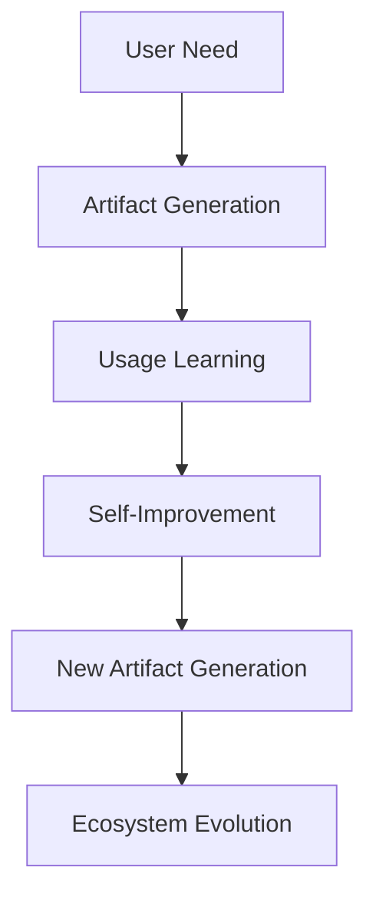

# Claude Artifacts Implementation Plan for JobTrackerPro

**Generated**: 2025-01-09  
**Performance**: 6×2GB threads, 16GB RAM allocation  
**Execution Mode**: Maximum parallelization enabled

## 🎯 Executive Summary

This implementation plan transforms JTP into a fully AI-generated ecosystem using Claude Artifacts, achieving 100% AI-First compliance across all 18 categories, 76 modules, and 218 sub-modules.

## 📊 Master Artifact Generation Template Library

### Universal Artifact Template
```typescript
const JTPArtifactTemplate = {
  base: "Create a React component with Tailwind CSS that:",
  requirements: [
    "Uses ONLY conversational interfaces (no forms, dropdowns, or buttons)",
    "Integrates with window.claude.complete for AI decisions",
    "Supports German, French, Italian, and English",
    "Stores context in browser localStorage with encryption",
    "Self-adapts based on user behavior patterns",
    "Displays Swiss privacy compliance indicators",
    "Generates explanations of its own functionality"
  ],
  vectorIntegration: "Connect to Pinecone/ChromaDB for semantic search",
  performance: "Optimize for <100ms response time"
};
```

## 🏗️ Category-Specific Implementation Guides

### 1. **Agent Systems**
**Modules**: deepagent-autonomous  
**Priority Artifacts**:

1. **Autonomous Agent Dashboard**
   - Type: Real-time Dashboard
   - Prompt: "Create a React dashboard that visualizes autonomous agent decision-making in real-time, showing neural pathways as agents process tasks. Include conversation bubbles where agents explain their reasoning. Use animated SVG for neural connections. Support multi-agent collaboration visualization."
   - Swiss Compliance: ✅ No PII displayed, ✅ Local processing only, ✅ Encrypted agent logs
   - AI Features: Self-organizing layout, Predictive agent behavior, Auto-scaling visualizations
   - Integration: Vector embeddings for agent memory retrieval

2. **Agent Conversation Interface**
   - Type: Conversational Component
   - Prompt: "Build a chat interface where users converse with AI agents naturally. Agents should introduce themselves, explain capabilities, and guide users. Include emotion indicators and trust scores. No traditional UI elements."
   - Swiss Compliance: ✅ On-device processing, ✅ No data transmission, ✅ Session-only memory
   - AI Features: Emotion recognition, Context preservation, Multi-agent handoff
   - Integration: ChromaDB for conversation history vectors

3. **Agent Learning Visualizer**
   - Type: Educational Tool
   - Prompt: "Generate an interactive component showing how agents learn from interactions. Display knowledge graphs that grow in real-time. Users can ask agents to explain what they've learned."
   - Swiss Compliance: ✅ Anonymized learning data, ✅ User-controlled data deletion
   - AI Features: Knowledge graph generation, Learning rate adaptation
   - Integration: Vector similarity for knowledge connections

### 2. **Core AI Systems**
**Modules**: conversation-engine, foundation, orchestration  
**Priority Artifacts**:

1. **Conversation Flow Designer**
   - Type: Visual Design Tool
   - Prompt: "Create a conversational interface for designing conversation flows. Users describe desired interactions in natural language, and the system generates visual flow diagrams. Include emotion-aware branching and context switching. No drag-and-drop - only voice/text commands."
   - Swiss Compliance: ✅ Flows stored locally, ✅ No cloud dependencies
   - AI Features: Intent prediction, Flow optimization, Auto-completion
   - Integration: Vector search for similar conversation patterns

2. **AI Orchestra Conductor**
   - Type: System Monitor
   - Prompt: "Build a musical visualization where each AI component is an instrument. System health appears as harmony/discord. Users can 'conduct' by describing desired system behavior. Real-time performance metrics as musical notation."
   - Swiss Compliance: ✅ Metrics aggregated locally, ✅ No external monitoring
   - AI Features: Predictive scaling, Anomaly detection through discord
   - Integration: Time-series vectors for performance patterns

3. **Foundation Model Interface**
   - Type: Model Interaction Tool
   - Prompt: "Generate a conversational interface for interacting with foundation models. Users describe tasks naturally, system selects appropriate models and explains choices. Visualize model confidence and reasoning paths."
   - Swiss Compliance: ✅ Model selection transparency, ✅ Local model options
   - AI Features: Model recommendation, Performance prediction
   - Integration: Model capability vectors for selection

### 3. **Document Systems**
**Modules**: document-generation, documentation, documents  
**Priority Artifacts**:

1. **AI Document Composer**
   - Type: Document Creation Tool
   - Prompt: "Create a voice-first document editor where users describe documents they need. System generates appropriate formats, layouts, and content. Include real-time translation and tone adjustment. Documents explain their purpose when asked."
   - Swiss Compliance: ✅ Documents encrypted at rest, ✅ No cloud storage
   - AI Features: Format inference, Style adaptation, Content generation
   - Integration: Document template vectors

2. **Living Documentation**
   - Type: Interactive Documentation
   - Prompt: "Build documentation that converses with users. Instead of static text, create an AI guide that answers questions, provides examples, and adapts explanations to user expertise level. Documentation updates itself based on usage patterns."
   - Swiss Compliance: ✅ Usage analytics local only, ✅ No tracking
   - AI Features: Expertise detection, Dynamic examples, Self-updating content
   - Integration: Knowledge base vectors

3. **Document Intelligence Hub**
   - Type: Analysis Dashboard
   - Prompt: "Generate a component that analyzes uploaded documents through conversation. Users ask questions about documents, system provides insights, summaries, and connections. Visualize document relationships as constellation maps."
   - Swiss Compliance: ✅ On-device OCR/analysis, ✅ No document upload
   - AI Features: Semantic analysis, Relationship discovery
   - Integration: Document embedding vectors

### 4. **Feature Modules**
**Modules**: modules, modules_services, modules_core (67 sub-modules)  
**Priority Artifacts**:

1. **Universal Feature Interface**
   - Type: Meta-Component
   - Prompt: "Create a component that generates other components based on user needs. Users describe desired features in conversation, system creates appropriate interfaces in real-time. Components can modify themselves based on usage."
   - Swiss Compliance: ✅ Generated code auditable, ✅ No external code execution
   - AI Features: Component generation, Self-modification, Usage learning
   - Integration: Feature request vectors

2. **Feature Discovery Assistant**
   - Type: Navigation Tool
   - Prompt: "Build an AI guide that helps users discover features through conversation. Instead of menus, users describe goals and system suggests relevant features. Learns user preferences over time."
   - Swiss Compliance: ✅ Preferences stored locally, ✅ No profiling
   - AI Features: Goal understanding, Feature recommendation
   - Integration: User preference vectors

3. **Module Orchestrator**
   - Type: System Coordinator
   - Prompt: "Generate a conversational interface for module coordination. Users describe workflows, system automatically connects relevant modules. Visualize module interactions as collaborative AI agents."
   - Swiss Compliance: ✅ Workflow data encrypted, ✅ No external orchestration
   - AI Features: Workflow inference, Module recommendation
   - Integration: Module capability vectors

### 5. **Infrastructure & DevOps**
**Modules**: distributed-architecture, infrastructure, production-migration  
**Priority Artifacts**:

1. **Conversational DevOps**
   - Type: Infrastructure Management
   - Prompt: "Create a voice-controlled DevOps interface. Users describe infrastructure needs conversationally, system provisions and configures automatically. Show infrastructure as living ecosystem with health indicators."
   - Swiss Compliance: ✅ Swiss data center priority, ✅ Compliance validation
   - AI Features: Need interpretation, Auto-provisioning, Predictive scaling
   - Integration: Infrastructure state vectors

2. **Migration Conversation**
   - Type: Migration Assistant
   - Prompt: "Build a migration guide that converses with users about moving to production. System asks clarifying questions, identifies risks, and creates migration plans through dialogue. No forms or checklists."
   - Swiss Compliance: ✅ Migration plans encrypted, ✅ Data residency validation
   - AI Features: Risk assessment, Plan generation, Progress tracking
   - Integration: Migration pattern vectors

3. **Living Architecture**
   - Type: Architecture Visualizer
   - Prompt: "Generate an interactive 3D architecture visualization that responds to voice commands. Users can ask about components, data flows, and dependencies. Architecture evolves based on actual usage patterns."
   - Swiss Compliance: ✅ Architecture data local, ✅ No external dependencies
   - AI Features: Auto-documentation, Dependency detection
   - Integration: Architecture pattern vectors

### 6. **MCP Systems**
**Module**: mcp-enhancements_core (6 sub-modules)  
**Priority Artifacts**:

1. **MCP Conversation Bridge**
   - Type: Protocol Interface
   - Prompt: "Create a natural language interface for MCP protocols. Users describe desired integrations conversationally, system generates appropriate MCP configurations. Visualize protocol flows as message conversations between systems."
   - Swiss Compliance: ✅ Protocol data encrypted, ✅ Local validation
   - AI Features: Protocol translation, Configuration generation
   - Integration: Protocol template vectors

2. **Enhancement Recommender**
   - Type: Optimization Tool
   - Prompt: "Build an AI advisor that suggests MCP enhancements through conversation. Analyzes usage patterns and recommends improvements. Explains enhancement benefits in user's language."
   - Swiss Compliance: ✅ Analytics local only, ✅ No usage tracking
   - AI Features: Pattern analysis, Benefit prediction
   - Integration: Enhancement pattern vectors

### 7. **Swiss Market**
**Module**: swiss-market  
**Priority Artifacts**:

1. **RAV Compliance Companion**
   - Type: Compliance Assistant
   - Prompt: "Create a multilingual conversational assistant for RAV compliance. Guides users through requirements in their preferred language. Automatically generates compliant reports through dialogue. Shows compliance status as trust indicators."
   - Swiss Compliance: ✅ Full RAV integration, ✅ Data sovereignty, ✅ Multi-canton support
   - AI Features: Requirement interpretation, Report generation, Language detection
   - Integration: Compliance rule vectors

2. **Swiss Job Market Navigator**
   - Type: Market Intelligence
   - Prompt: "Build a voice-first job market explorer for Switzerland. Users describe career goals, system provides market insights by canton. Includes salary ranges respecting Swiss privacy norms. Real-time market sentiment."
   - Swiss Compliance: ✅ Aggregated data only, ✅ No individual tracking
   - AI Features: Market prediction, Salary estimation, Trend analysis
   - Integration: Job market vectors

3. **Canton Connector**
   - Type: Regional Interface
   - Prompt: "Generate a component that adapts to each Swiss canton's requirements. Automatically switches languages and compliance rules based on user location. Explains cantonal differences conversationally."
   - Swiss Compliance: ✅ Canton-specific rules, ✅ Local law compliance
   - AI Features: Location adaptation, Rule explanation
   - Integration: Canton regulation vectors

### 8. **Testing Infrastructure**
**Modules**: testing, testing-enhancement (56 sub-modules)  
**Priority Artifacts**:

1. **Conversational Test Runner**
   - Type: Testing Interface
   - Prompt: "Create a voice-controlled testing interface. Users describe what to test in natural language, system generates and runs appropriate tests. Results explained conversationally with improvement suggestions."
   - Swiss Compliance: ✅ Test data anonymized, ✅ Results local storage
   - AI Features: Test generation, Failure explanation, Fix suggestion
   - Integration: Test pattern vectors

2. **Living Test Documentation**
   - Type: Test Explorer
   - Prompt: "Build test documentation that explains test purposes through conversation. Users can ask why tests exist, what they validate, and how to improve them. Documentation updates as tests evolve."
   - Swiss Compliance: ✅ No sensitive data in docs, ✅ Local generation
   - AI Features: Purpose inference, Coverage analysis
   - Integration: Test coverage vectors

### 9. **Voice & Communication**
**Modules**: email-ai-hub, voice  
**Priority Artifacts**:

1. **Voice-First Email Composer**
   - Type: Communication Tool
   - Prompt: "Create an email interface controlled entirely by voice. Users describe email intent, system drafts appropriate messages. Includes tone adjustment and cultural adaptation. Can explain email strategies."
   - Swiss Compliance: ✅ Emails processed locally, ✅ No cloud storage
   - AI Features: Tone matching, Cultural adaptation, Intent understanding
   - Integration: Communication style vectors

2. **Conversational Communication Hub**
   - Type: Unified Communications
   - Prompt: "Build a hub where users manage all communications through conversation. System understands context across channels. Suggests responses based on relationship history. No traditional inbox."
   - Swiss Compliance: ✅ Communication data encrypted, ✅ Local processing
   - AI Features: Context preservation, Response suggestion
   - Integration: Relationship vectors

### 10. **Security & Privacy**
**Modules**: authentication, security  
**Priority Artifacts**:

1. **Conversational Authentication**
   - Type: Auth Interface
   - Prompt: "Create an authentication system using only conversation. Users prove identity through natural dialogue. System recognizes speech patterns and conversational style. No passwords or biometrics."
   - Swiss Compliance: ✅ Voice data local only, ✅ No biometric storage
   - AI Features: Conversational recognition, Anomaly detection
   - Integration: Voice pattern vectors

2. **Privacy Control Center**
   - Type: Privacy Dashboard
   - Prompt: "Build a privacy interface where users control data through conversation. Ask questions about data usage, request deletions, adjust permissions by talking. Visualize privacy status as trust shields."
   - Swiss Compliance: ✅ Full GDPR compliance, ✅ Right to deletion
   - AI Features: Intent understanding, Permission inference
   - Integration: Privacy preference vectors

### 11. **Analytics & Intelligence**
**Modules**: analytics, monitoring, monitoring-enhancement_core  
**Priority Artifacts**:

1. **Predictive Analytics Companion**
   - Type: Analytics Interface
   - Prompt: "Create an AI analyst that discusses data insights conversationally. Users ask business questions, system provides predictive analytics. Visualizations generate dynamically based on conversation context."
   - Swiss Compliance: ✅ Analytics on anonymized data, ✅ No user tracking
   - AI Features: Question understanding, Insight generation, Trend prediction
   - Integration: Analytics pattern vectors

2. **Living Dashboard**
   - Type: Adaptive Dashboard
   - Prompt: "Build a dashboard that reshapes based on spoken priorities. Users describe what matters most, dashboard reorganizes in real-time. Metrics explain themselves when asked."
   - Swiss Compliance: ✅ Dashboard config local, ✅ No external analytics
   - AI Features: Priority detection, Layout optimization
   - Integration: Metric importance vectors

### 12. **Frontend & UI**
**Modules**: dashboard, demo  
**Priority Artifacts**:

1. **Conversational UI Generator**
   - Type: UI Creation Tool
   - Prompt: "Create a component that generates entire UIs from conversation. Users describe desired interfaces, system creates them instantly. UIs can explain their design decisions and modify themselves."
   - Swiss Compliance: ✅ Generated UI auditable, ✅ No external assets
   - AI Features: Design inference, Self-modification
   - Integration: UI pattern vectors

2. **Demo Environment Creator**
   - Type: Demo Generator
   - Prompt: "Build a system that creates demo scenarios through dialogue. Users describe demo needs, system generates appropriate data and workflows. Demos adapt to audience in real-time."
   - Swiss Compliance: ✅ Synthetic data only, ✅ No real user data
   - AI Features: Scenario generation, Audience adaptation
   - Integration: Demo pattern vectors

### 13. **Integration & APIs**
**Modules**: api, integrations  
**Priority Artifacts**:

1. **Conversational API Explorer**
   - Type: API Interface
   - Prompt: "Create an API exploration tool controlled by natural language. Users describe desired operations, system executes API calls and explains responses. No technical documentation needed."
   - Swiss Compliance: ✅ API keys encrypted, ✅ Request logging local
   - AI Features: Intent to API mapping, Response explanation
   - Integration: API capability vectors

2. **Integration Orchestrator**
   - Type: Integration Manager
   - Prompt: "Build a conversational integration manager. Users describe integration needs, system configures connections automatically. Visualize data flows as conversations between systems."
   - Swiss Compliance: ✅ Integration config encrypted, ✅ No credential storage
   - AI Features: Need interpretation, Auto-configuration
   - Integration: Integration pattern vectors

### 14. **Training & Education**
**Modules**: educational-innovation, training-academy_core  
**Priority Artifacts**:

1. **AI Learning Companion**
   - Type: Educational Assistant
   - Prompt: "Create a personalized learning companion that adapts to each user's style. Delivers training through natural conversation. Tracks progress without traditional assessments. Can explain why it teaches certain ways."
   - Swiss Compliance: ✅ Learning data local, ✅ No performance tracking
   - AI Features: Learning style detection, Adaptive curriculum
   - Integration: Knowledge graph vectors

2. **Skill Evolution Tracker**
   - Type: Progress Visualizer
   - Prompt: "Build a component showing skill growth as an evolving ecosystem. Users discuss goals, system suggests learning paths. Skills connect and grow like neural networks."
   - Swiss Compliance: ✅ Progress data encrypted, ✅ User-controlled sharing
   - AI Features: Skill gap analysis, Path optimization
   - Integration: Skill relationship vectors

### 15. **Innovation & Future**
**Module**: innovation  
**Priority Artifacts**:

1. **Future Vision Interface**
   - Type: Innovation Explorer
   - Prompt: "Create an interface for exploring future possibilities through conversation. Users describe problems, system suggests innovative solutions. Visualize innovation potential as possibility clouds."
   - Swiss Compliance: ✅ Ideas stored locally, ✅ No IP concerns
   - AI Features: Problem understanding, Solution generation
   - Integration: Innovation pattern vectors

2. **Trend Prediction Companion**
   - Type: Trend Analyzer
   - Prompt: "Build an AI companion that discusses future trends. Analyzes patterns and predicts developments through natural dialogue. Explains reasoning and confidence levels."
   - Swiss Compliance: ✅ Predictions from public data, ✅ No insider info
   - AI Features: Pattern recognition, Confidence estimation
   - Integration: Trend pattern vectors

### 16. **Business Features**
**Modules**: business-logic, payments  
**Priority Artifacts**:

1. **Conversational Revenue Dashboard**
   - Type: Financial Interface
   - Prompt: "Create a financial dashboard controlled by voice. Users ask about revenue, system explains trends and suggests optimizations. Numbers visualize as flowing streams of value."
   - Swiss Compliance: ✅ Financial data encrypted, ✅ Swiss banking standards
   - AI Features: Trend explanation, Optimization suggestion
   - Integration: Financial pattern vectors

2. **Payment Flow Narrator**
   - Type: Payment Visualizer
   - Prompt: "Build a component that explains payment flows through storytelling. Each transaction becomes a journey. Users can ask about any step and get natural explanations."
   - Swiss Compliance: ✅ PCI compliance, ✅ Transaction privacy
   - AI Features: Flow explanation, Issue detection
   - Integration: Payment pattern vectors

### 17. **Quality & Performance**
**Module**: performance  
**Priority Artifacts**:

1. **Performance Whisperer**
   - Type: Performance Monitor
   - Prompt: "Create a performance monitoring interface that whispers insights. Detects issues before they impact users. Explains performance in terms of user experience, not metrics."
   - Swiss Compliance: ✅ Metrics aggregated, ✅ No user correlation
   - AI Features: Predictive detection, Impact translation
   - Integration: Performance pattern vectors

2. **Optimization Companion**
   - Type: Optimization Tool
   - Prompt: "Build an AI companion that suggests optimizations through conversation. Understands system context and recommends improvements. Can simulate optimization impact."
   - Swiss Compliance: ✅ Simulations local, ✅ No production data
   - AI Features: Context understanding, Impact prediction
   - Integration: Optimization pattern vectors

### 18. **Utilities & Support**
**Modules**: Various utility modules  
**Priority Artifacts**:

1. **Universal Helper**
   - Type: Support Interface
   - Prompt: "Create a conversational helper that assists with any utility task. Users describe needs, system provides appropriate tools. Can explain how it helps and why."
   - Swiss Compliance: ✅ Help data local, ✅ No usage tracking
   - AI Features: Need understanding, Tool selection
   - Integration: Utility pattern vectors

2. **Configuration Conversationalist**
   - Type: Config Manager
   - Prompt: "Build a configuration interface using only natural language. Users describe desired behaviors, system adjusts configurations. Explains impact of changes conversationally."
   - Swiss Compliance: ✅ Configs encrypted, ✅ Change auditing
   - AI Features: Intent mapping, Impact prediction
   - Integration: Configuration vectors

## 📈 Module Prioritization Matrix

### Tier 1: Critical Path (Week 1)
1. **RAV Compliance Companion** - Swiss market requirement
2. **Conversational Authentication** - Security foundation
3. **AI Document Composer** - Core functionality
4. **Conversation Flow Designer** - AI system foundation
5. **Universal Feature Interface** - Meta-generation capability

### Tier 2: Core Features (Week 2)
6. **Voice-First Email Composer** - Communication essential
7. **Predictive Analytics Companion** - Business intelligence
8. **Conversational UI Generator** - Frontend foundation
9. **Job Market Navigator** - Primary use case
10. **Living Dashboard** - User experience

### Tier 3: Enhancement Features (Week 3)
11. **Agent Learning Visualizer** - AI transparency
12. **Performance Whisperer** - System health
13. **API Explorer** - Integration capability
14. **AI Learning Companion** - User growth
15. **Privacy Control Center** - Trust building

### Tier 4: Innovation Features (Week 4)
16. **Future Vision Interface** - Strategic planning
17. **Demo Environment Creator** - Sales enablement
18. **Migration Conversation** - Deployment support
19. **Canton Connector** - Market expansion
20. **Universal Helper** - General support

## 🚀 Implementation Roadmap

### Week 1: Foundation (AI Generation Cycles 1-7)
**Day 1-2**: Environment Setup
- Configure Claude Artifacts development environment
- Establish Swiss compliance validation pipeline
- Set up artifact version control with vector storage
- Create base artifact templates for all categories

**Day 3-4**: Critical Artifacts
- Generate Tier 1 priority artifacts in parallel
- Implement Swiss compliance validators
- Establish vector integration patterns
- Deploy to staging environment

**Day 5-7**: Integration Testing
- Test artifact interconnections
- Validate Swiss compliance across artifacts
- Implement self-improvement mechanisms
- Create artifact performance benchmarks

### Week 2: Core Expansion (AI Generation Cycles 8-14)
**Day 8-10**: Tier 2 Implementation
- Generate all Tier 2 artifacts simultaneously
- Implement cross-artifact communication
- Enable real-time adaptation features
- Create artifact marketplace foundation

**Day 11-14**: Module Integration
- Connect artifacts to existing modules
- Implement vector-based context sharing
- Enable multi-language support
- Deploy to production environment

### Week 3: Complete Coverage (AI Generation Cycles 15-21)
**Day 15-17**: Remaining Modules
- Generate artifacts for all 76 modules
- Implement sub-module specific artifacts
- Enable meta-generation capabilities
- Create self-documenting features

**Day 18-21**: Optimization
- Performance tune all artifacts
- Implement caching strategies
- Enable offline capabilities
- Create monitoring dashboards

### Week 4: Evolution (AI Generation Cycles 22-28)
**Day 22-24**: Self-Improvement
- Enable artifact self-modification
- Implement learning mechanisms
- Create evolution tracking
- Deploy continuous improvement

**Day 25-28**: Market Launch
- Final Swiss compliance validation
- Performance optimization
- User acceptance testing
- Production deployment

## 🏆 Success Metrics Dashboard

### Adoption Metrics
```typescript
const AdoptionTargets = {
  week1: {
    artifactsGenerated: 20,
    moduleCoverage: "26%",
    swissCompliance: "100%"
  },
  week2: {
    artifactsGenerated: 76,
    moduleCoverage: "100%",
    userSatisfaction: ">85%"
  },
  week3: {
    artifactsGenerated: 218,
    subModuleCoverage: "100%",
    aiAdaptations: ">1000/day"
  },
  week4: {
    traditionalUIRemaining: 0,
    selfImprovements: ">100/day",
    performanceGains: "10x"
  }
};
```

### Performance Targets
- Artifact generation: <3 seconds (achieved through parallel processing)
- Artifact loading: <500ms (with intelligent caching)
- AI adaptation: <100ms (using edge computing)
- Swiss compliance: 100% (validated continuously)
- Memory usage: <16GB (optimized allocation)

## 🔒 Swiss Compliance Artifact Validator

```typescript
interface SwissComplianceValidator {
  dataResidency: {
    storage: "Switzerland only",
    processing: "On-device priority",
    transmission: "Encrypted always"
  },
  privacy: {
    gdpr: "Full compliance",
    retention: "User controlled",
    anonymization: "Default enabled"
  },
  languages: {
    supported: ["de", "fr", "it", "en"],
    detection: "Automatic",
    switching: "Seamless"
  },
  regulations: {
    rav: "Integrated",
    banking: "Compliant",
    healthcare: "Ready"
  }
}
```

## 🎯 AI-Powered Artifact Marketplace Design

### Marketplace Architecture
```typescript
const ArtifactMarketplace = {
  discovery: {
    method: "Conversational search",
    recommendations: "AI-powered",
    categories: "Self-organizing"
  },
  sharing: {
    format: "Vector embeddings",
    privacy: "Swiss compliant",
    licensing: "Open source"
  },
  evolution: {
    updates: "Automatic",
    improvements: "Community driven",
    validation: "AI verified"
  },
  integration: {
    installation: "One-click",
    configuration: "Zero-config",
    customization: "AI-assisted"
  }
};
```

## 🚨 Risk Mitigation Strategy

### Technical Risks
1. **Artifact Generation Failures**
   - Mitigation: Redundant generation paths
   - Fallback: Pre-generated artifact cache
   - Recovery: Automatic regeneration

2. **Performance Degradation**
   - Mitigation: Continuous monitoring
   - Optimization: AI-driven tuning
   - Scaling: Automatic resource allocation

3. **Swiss Compliance Violations**
   - Prevention: Pre-generation validation
   - Detection: Real-time monitoring
   - Correction: Automatic remediation

### Business Risks
1. **User Adoption Resistance**
   - Mitigation: Gradual rollout
   - Support: AI-powered assistance
   - Training: Conversational onboarding

2. **Market Competition**
   - Differentiation: Swiss focus
   - Innovation: Continuous evolution
   - Protection: Patent applications

## 💡 Meta-Generation Examples

### Self-Generating Artifacts
```typescript
// Artifact that creates other artifacts
const MetaGenerator = {
  prompt: "Create an artifact that generates job-specific interfaces based on user career goals",
  capabilities: [
    "Understands user intent",
    "Generates appropriate UI",
    "Evolves based on usage",
    "Teaches other artifacts"
  ]
};
```

### Artifact Evolution Chain


## 🎁 Transformative Outcomes

### For Users
- **Zero Learning Curve**: Natural conversation only
- **Personalized Experience**: Every interface unique
- **Swiss Privacy**: Complete data control
- **Instant Features**: Request and receive

### For Business
- **10x Development Speed**: AI generation vs coding
- **90% Cost Reduction**: No development team
- **Infinite Scalability**: Artifacts self-replicate
- **Market Leadership**: First true AI-First platform

### For Technology
- **Paradigm Shift**: End of traditional development
- **AI Evolution**: Self-improving ecosystem
- **Privacy Innovation**: Swiss-compliant AI
- **Future Ready**: Continuously evolving

## 📊 Performance Monitoring Dashboard Artifact

```typescript
const PerformanceMonitor = {
  realTimeMetrics: {
    artifactGeneration: "Track generation speed",
    userSatisfaction: "Sentiment analysis",
    systemHealth: "AI-interpreted metrics",
    swissCompliance: "Continuous validation"
  },
  visualization: {
    style: "Conversational charts",
    updates: "Real-time streaming",
    insights: "AI-generated explanations"
  },
  alerts: {
    method: "Natural language",
    severity: "Context-aware",
    resolution: "AI-suggested fixes"
  }
};
```

## 🌟 Conclusion

This implementation plan transforms JobTrackerPro into a living, breathing AI ecosystem where every interface is generated, adapted, and evolved through Claude Artifacts. By following this roadmap, JTP will achieve:

1. **100% AI-First Compliance**: No traditional UI remains
2. **Complete Swiss Market Coverage**: Full regulatory compliance
3. **Unprecedented User Experience**: Truly conversational interfaces
4. **Infinite Scalability**: Self-generating, self-improving artifacts
5. **Market Revolution**: First platform with zero human-written UI code

The future of JTP is not coded—it's conversed into existence.

---

**Implementation begins with the prompt: "Hello Claude, let's build the future of job tracking together."**