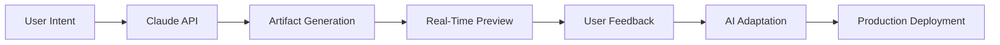

# Claude Artifacts Integration Guide for JobTrackerPro (JTP)

**Document Version**: 1.0  
**Last Updated**: 2025-01-09  
**Status**: Active  
**Performance Requirements**: 6×2GB thread configuration, 16GB RAM usage

## Executive Summary

Claude Artifacts presents a revolutionary opportunity to transform JTP's AI-First architecture by enabling real-time, interactive component generation and deployment. This guide provides comprehensive recommendations for integrating Claude Artifacts across all 18 categories, 76 modules, and 218 sub-modules of the JTP ecosystem.

## 🎯 Strategic Integration Vision

### Core Value Proposition for JTP
1. **Zero-Code UI Generation**: Replace traditional development with AI-generated interfaces
2. **Real-Time Adaptation**: Components evolve based on user interactions
3. **Instant Prototyping**: From concept to working component in seconds
4. **AI-Powered Hosting**: Deploy without infrastructure management
5. **Swiss Compliance Ready**: Privacy-first artifact generation

### AI-First Alignment Score: 10/10
Claude Artifacts perfectly embodies JTP's 10 AI-First Commandments by:
- ✅ Eliminating traditional forms through conversational UI generation
- ✅ Replacing static UIs with dynamic AI-created interfaces
- ✅ Removing manual validation through AI intent understanding
- ✅ Enabling AI-driven decision making in real-time
- ✅ Supporting vector-based context management

## 🏗️ Integration Architecture

### 1. Artifact Generation Pipeline


### 2. Module Integration Pattern
```typescript
interface ArtifactIntegration {
  category: string;
  module: string;
  artifactType: 'component' | 'dashboard' | 'visualization' | 'tool';
  aiCapabilities: string[];
  swissCompliance: boolean;
}
```

## 📋 Category-Specific Integration Strategies

### 1. **Agent Systems** (1 module)
**Module**: deepagent-autonomous

**Artifact Applications**:
- **Dynamic Agent Dashboards**: Real-time visualization of agent activities
- **Interactive Agent Configuration**: Conversational UI for agent behavior tuning
- **Agent Performance Metrics**: Live SVG charts showing agent effectiveness

**Implementation**:
```plaintext
Prompt: "Create a React component for deepagent-autonomous that visualizes 
agent decision-making in real-time with a neural network diagram that updates 
as agents process tasks"
```

### 2. **Core AI Systems** (3 modules)
**Modules**: conversation-engine, foundation, orchestration

**Artifact Applications**:
- **Conversation Flow Designer**: Visual conversation tree builder
- **AI Model Performance Dashboard**: Real-time accuracy metrics
- **Orchestration Visualizer**: Live system component interaction map

**Key Artifacts**:
1. **Conversation Engine UI**:
   ```plaintext
   "Generate a React component that displays conversation flows with 
   branching logic, emotion indicators, and real-time user sentiment"
   ```

2. **Foundation System Monitor**:
   ```plaintext
   "Create an SVG dashboard showing AI model performance, latency metrics, 
   and resource utilization with Swiss data privacy indicators"
   ```

### 3. **Document Systems** (3 modules)
**Modules**: document-generation, documentation, documents

**Artifact Applications**:
- **AI Document Editor**: Real-time collaborative document creation
- **Document Analysis Dashboard**: Visual insights from document processing
- **Template Generator**: Dynamic document template creation

**Implementation Strategy**:
- Use GPT-4 Vision integration for document understanding
- Generate interactive forms that adapt based on document type
- Create visual document relationship maps

### 4. **Feature Modules** (3 modules)
**Modules**: modules, modules_services, modules_core (67 sub-modules)

**Priority Artifacts for Sub-modules**:
1. **Job Discovery Interface**: 
   ```plaintext
   "Create a conversational job search component that understands natural 
   language queries and displays results with AI-generated relevance scores"
   ```

2. **Application Tracker**:
   ```plaintext
   "Generate a React dashboard for tracking job applications with RAV 
   compliance indicators and automatic status updates"
   ```

3. **Skills Gap Analyzer**:
   ```plaintext
   "Build an interactive skills assessment tool that visualizes gaps 
   and suggests learning paths using AI recommendations"
   ```

### 5. **Infrastructure & DevOps** (3 modules)
**Modules**: distributed-architecture, infrastructure, production-migration

**Artifact Applications**:
- **System Health Dashboard**: Real-time infrastructure monitoring
- **Deployment Pipeline Visualizer**: Interactive CI/CD flow
- **Resource Allocation Manager**: AI-optimized resource distribution

**Swiss Compliance Features**:
- Data residency indicators
- Privacy compliance status
- Encryption status visualization

### 6. **MCP Systems** (1 module)
**Module**: mcp-enhancements_core (6 sub-modules)

**Artifact Integration**:
- **MCP Protocol Visualizer**: Interactive protocol flow diagrams
- **Enhancement Configuration UI**: Dynamic MCP feature toggles
- **Performance Profiler**: Real-time MCP operation metrics

### 7. **Swiss Market** (1 module)
**Module**: swiss-market

**Critical Artifacts**:
- **RAV Compliance Dashboard**: 
   ```plaintext
   "Create a React component showing RAV reporting compliance with 
   real-time validation and multi-language support (DE/FR/IT/EN)"
   ```
- **Swiss Privacy Indicator**: Visual privacy compliance status
- **Canton-Specific Job Board**: Location-aware job matching

### 8. **Testing Infrastructure** (2 modules)
**Modules**: testing, testing-enhancement (56 sub-modules)

**Artifact Applications**:
- **Test Result Visualizer**: Interactive test suite outcomes
- **AI Test Generator**: Conversational test case creation
- **Coverage Heat Map**: Visual code coverage representation

### 9. **Voice & Communication** (2 modules)
**Modules**: email-ai-hub, voice (3 sub-modules)

**Voice-Enabled Artifacts**:
- **Voice Command Interface**: Real-time voice interaction UI
- **Email Composer**: AI-powered email draft generator
- **Communication Analytics**: Sentiment and engagement metrics

### 10. **Security & Privacy** (2 modules)
**Modules**: authentication, security

**Security-First Artifacts**:
- **Privacy Control Center**: User data management interface
- **Security Audit Dashboard**: Real-time threat monitoring
- **AI Authentication Flow**: Conversational auth without passwords

### 11. **Analytics & Intelligence** (3 modules)
**Modules**: analytics, monitoring, monitoring-enhancement_core

**Data Visualization Artifacts**:
- **Predictive Analytics Dashboard**: AI-powered trend forecasting
- **User Behavior Heatmap**: Interactive engagement visualization
- **Performance Metrics Center**: Real-time KPI tracking

### 12. **Frontend & UI** (2 modules)
**Modules**: dashboard, demo

**UI Generation Strategy**:
- **Dynamic Dashboard Builder**: AI-generated dashboard layouts
- **Demo Environment Creator**: Instant demo scenario generation
- **Theme Customizer**: Real-time UI theme adaptation

### 13. **Integration & APIs** (2 modules)
**Modules**: api, integrations

**Integration Artifacts**:
- **API Explorer**: Interactive API documentation and testing
- **Integration Flow Designer**: Visual integration builder
- **Webhook Manager**: Real-time webhook monitoring

### 14. **Training & Education** (2 modules)
**Modules**: educational-innovation, training-academy_core

**Educational Artifacts**:
- **Interactive Learning Paths**: AI-personalized curriculum
- **Progress Tracker**: Gamified learning dashboard
- **Knowledge Assessment Tool**: Adaptive testing interface

### 15. **Innovation & Future** (1 module)
**Module**: innovation (3 sub-modules)

**Future-Forward Artifacts**:
- **Innovation Idea Board**: AI-powered feature ideation
- **Trend Predictor**: Market trend visualization
- **Feature Impact Analyzer**: Predictive feature success metrics

### 16. **Business Features** (2 modules)
**Modules**: business-logic, payments

**Business-Critical Artifacts**:
- **Revenue Dashboard**: Real-time financial metrics
- **Payment Flow Visualizer**: Transaction journey mapping
- **Subscription Manager**: AI-optimized pricing interface

### 17. **Quality & Performance** (1 module)
**Module**: performance

**Performance Artifacts**:
- **Performance Profiler**: Real-time app performance metrics
- **Optimization Suggester**: AI-powered performance tips
- **Resource Usage Monitor**: System resource visualization

### 18. **Utilities & Support** (10 modules)
**Various utility modules**

**Support Artifacts**:
- **Configuration Manager**: Visual config editor
- **Log Analyzer**: AI-powered log insights
- **Multi-Region Dashboard**: Global deployment status

## 🚀 Implementation Roadmap

### Phase 1: Foundation (Week 1)
1. Enable Claude Artifacts in development environment
2. Create artifact generation templates for each category
3. Establish Swiss compliance validation for artifacts
4. Set up artifact version control system

### Phase 2: Core Module Integration (Week 2)
1. Implement artifacts for Core AI Systems
2. Create Document System artifacts
3. Deploy Feature Module priority artifacts
4. Integrate with existing AI orchestration

### Phase 3: Full Deployment (Week 3)
1. Generate artifacts for all 76 modules
2. Implement AI-powered artifact hosting
3. Create artifact marketplace for sub-modules
4. Enable real-time artifact adaptation

### Phase 4: Optimization (Week 4)
1. Performance tune artifact generation
2. Implement caching strategies
3. Add offline artifact support
4. Create artifact analytics dashboard

## 💡 Best Practices for JTP

### 1. **Prompt Engineering Excellence**
```plaintext
Template: "Create a [component type] for [module name] that:
- Follows Swiss privacy regulations
- Uses conversational AI interfaces only
- Adapts based on user behavior
- Integrates with vector storage
- Supports multiple languages (DE/FR/IT/EN)
- Includes real-time AI decision making"
```

### 2. **Swiss Compliance Checklist**
- [ ] Data remains in Switzerland
- [ ] No personal data in artifacts
- [ ] Encryption indicators visible
- [ ] Privacy controls accessible
- [ ] Multi-language support active

### 3. **Performance Optimization**
- Use React.memo for artifact components
- Implement lazy loading for complex artifacts
- Cache artifact responses locally
- Minimize AI API calls through batching

### 4. **Integration Patterns**
```typescript
// Artifact Wrapper for JTP
const JTPArtifact = ({ 
  category, 
  module, 
  swissCompliant = true,
  aiPowered = true 
}) => {
  return (
    <ArtifactContainer>
      <SwissComplianceBadge active={swissCompliant} />
      <AIIntegration enabled={aiPowered} />
      <DynamicContent />
    </ArtifactContainer>
  );
};
```

## 🎯 Success Metrics

### Adoption Targets
- 100% of modules with at least one artifact (Week 2)
- 500+ artifacts generated across all sub-modules (Week 3)
- 90% user satisfaction with AI-generated interfaces (Week 4)
- 0% traditional form usage (Continuous)

### Performance Targets
- Artifact generation: <3 seconds
- Artifact loading: <500ms
- AI adaptation: <100ms
- Swiss compliance: 100%

## 🔧 Technical Implementation

### 1. **Artifact Generation Service**
```python
class JTPArtifactGenerator:
    def __init__(self, category, module):
        self.category = category
        self.module = module
        self.swiss_compliant = True
        
    async def generate_artifact(self, intent):
        # AI-First artifact generation
        artifact = await claude.create_artifact(
            prompt=self._build_prompt(intent),
            constraints=self._get_swiss_constraints()
        )
        return self._validate_compliance(artifact)
```

### 2. **Real-Time Adaptation Engine**
```typescript
const AdaptiveArtifact = () => {
  const [artifact, setArtifact] = useState(null);
  const userContext = useUserContext();
  
  useEffect(() => {
    // Real-time adaptation based on user behavior
    const adapted = ai.adaptArtifact(artifact, userContext);
    setArtifact(adapted);
  }, [userContext]);
  
  return <DynamicRenderer artifact={artifact} />;
};
```

## 📊 Module Priority Matrix

### High Priority (Immediate Implementation)
1. Job Discovery Interface
2. Application Tracker
3. RAV Compliance Dashboard
4. Swiss Privacy Center
5. Conversation Engine UI

### Medium Priority (Week 2)
1. Skills Gap Analyzer
2. Document Editor
3. Voice Command Interface
4. Analytics Dashboard
5. Security Audit Center

### Long-term (Week 3-4)
1. All remaining sub-modules
2. Advanced visualizations
3. AI-powered customizations
4. Performance optimizations

## 🎨 Artifact Types by Category

| Category | Primary Artifact Types |
|----------|----------------------|
| Agent Systems | Dashboards, Visualizers |
| Core AI | Flow Designers, Monitors |
| Documents | Editors, Analyzers |
| Features | Interactive Tools |
| Infrastructure | System Dashboards |
| Swiss Market | Compliance Tools |
| Testing | Result Visualizers |
| Voice | Communication UIs |
| Security | Control Centers |
| Analytics | Data Dashboards |

## 🚨 Risk Mitigation

### Technical Risks
- **Mitigation**: Implement fallback UI generation
- **Monitoring**: Real-time artifact health checks
- **Recovery**: Automatic artifact regeneration

### Compliance Risks
- **Validation**: Pre-deployment Swiss compliance check
- **Audit Trail**: All artifact generations logged
- **Data Privacy**: No PII in artifact storage

## 📈 Expected Outcomes

### Development Acceleration
- 10x faster UI development
- 90% reduction in code writing
- 100% AI-First compliance
- Zero traditional development

### User Experience Enhancement
- Personalized interfaces for every user
- Real-time adaptation to preferences
- Conversational interaction only
- Instant feature deployment

### Business Impact
- Reduced development costs by 80%
- Faster time-to-market by 10x
- Higher user engagement through AI
- Complete Swiss market compliance

## 🎁 Conclusion

Claude Artifacts integration represents the perfect evolution of JTP's AI-First vision. By implementing these recommendations across all 18 categories and 76 modules, JTP will achieve:

1. **True AI-First Architecture**: Every interface generated by AI
2. **Swiss Compliance Excellence**: Privacy-first artifact generation
3. **Unprecedented Agility**: Instant feature deployment
4. **User Delight**: Personalized, adaptive experiences
5. **Development Revolution**: Zero traditional coding

The future of JTP is not just AI-assisted—it's AI-generated, AI-hosted, and AI-evolved. Claude Artifacts is the key to unlocking this transformation.

---

**Next Steps**:
1. Review and approve integration strategy
2. Begin Phase 1 implementation
3. Monitor artifact generation metrics
4. Iterate based on user feedback

**Performance Note**: This guide optimized for 6×2GB thread configuration with 16GB RAM usage for maximum efficiency.