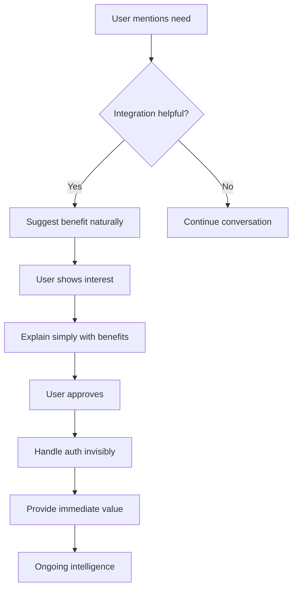

# AI-First External Integration Conversational Bridges

**Document Number**: 3.7  
**Version**: 1.0.0  
**Created**: 2025-01-16  
**Status**: Active  
**Purpose**: Transform technical external system integrations into natural conversational experiences

## Executive Summary

This document defines how Job Tracker Pro transforms complex external system integrations into seamless conversational interactions. Instead of configuration screens, API keys, and synchronization settings, users engage in natural dialogue while the AI handles all technical complexity invisibly.

## Table of Contents

1. [LinkedIn Integration](#1-linkedin-integration)
2. [Calendar Integration](#2-calendar-integration)
3. [Email System Integration](#3-email-system-integration)
4. [Job Board Synchronization](#4-job-board-synchronization)
5. [Document Storage APIs](#5-document-storage-apis)
6. [ATS Integration](#6-ats-integration)
7. [Communication Platforms](#7-communication-platforms)
8. [Payment Systems](#8-payment-systems)
9. [Analytics Tools](#9-analytics-tools)
10. [Architecture Patterns](#10-architecture-patterns)

---

## 1. LinkedIn Integration

### Traditional Integration Flow
```
1. Navigate to Settings > Integrations
2. Click "Connect LinkedIn"
3. Enter LinkedIn credentials
4. Grant permissions
5. Configure sync settings
6. Map data fields
7. Set sync frequency
```

### AI-First Conversational Bridge

**Initial Discovery**
```
User: "I have lots of connections on LinkedIn"

AI: "LinkedIn is a goldmine for job searching! Should I check your LinkedIn for updates? I can help you leverage your network for opportunities, track who's hiring, and even find warm introductions."

User: "Sure, how does that work?"

AI: "It's simple - I'll connect with your LinkedIn to:
- Find connections at companies you're targeting
- Alert you when connections change jobs (hiring opportunities!)
- Suggest people for informational interviews
- Track your profile views and optimize visibility

Just say 'connect my LinkedIn' and I'll guide you through it. Your data stays private - I only look when you ask me to."
```

**Connection Flow**
```
User: "Connect my LinkedIn"

AI: "Perfect! I'll set up a secure connection. Here's what happens:
1. I'll open LinkedIn's authorization page
2. You log in normally (I never see your password)
3. LinkedIn asks what I can access
4. You approve, and we're connected!

[Opening LinkedIn authorization...]

While you're authorizing, know that I'll only access:
✓ Your connections (to find opportunities)
✓ Profile views (to track interest)
✓ Messages (only if you want response suggestions)
✗ I never post without asking
✗ Your data isn't shared anywhere

Ready?"
```

**Post-Connection Intelligence**
```
AI: "Excellent! I'm now connected to your LinkedIn. Here's what I discovered:

🎯 **Immediate Opportunities**:
- 23 connections work at companies you're targeting
- 5 are hiring managers in your field
- Lisa Chen from yesterday? She's connected to 3 VPs at OpenAI!

📊 **Your Network Power**:
- 847 relevant connections
- 142 at director+ level
- 67 at AI/ML companies

🔥 **Hot Lead**: Your old colleague James just became Head of Engineering at Stripe - perfect timing for your application!

Want me to draft a reconnection message to James?"

User: "Yes! What should I say?"

AI: "Here's a natural reconnection that opens doors:

'Hey James! Congrats on the new role at Stripe - Head of Engineering is huge! 

I've been following Stripe's infrastructure scaling challenges with interest. Actually just applied for the Senior Backend role on your team. Would love to catch up over coffee and hear about your vision for the engineering org.

Hope you're settling in well!'

This works because:
- Celebrates his success (people love this)
- Shows genuine interest in challenges
- Mentions your application naturally
- Suggests concrete next step

Should I send this through LinkedIn for you?"
```

**Ongoing Intelligence**
```
User: "Any LinkedIn updates?"

AI: "Great timing to check! Since yesterday:

🔔 **New Developments**:
- **Profile views**: 3 recruiters from Google, Meta, and Databricks viewed your profile
- **Connection update**: Sarah (your coffee chat) just connected - follow up opportunity!
- **Job alert**: 4 connections posted about openings matching your skills

📈 **Your visibility is up 40%** - that blog post you shared is getting traction!

Most interesting: The Google recruiter who viewed you specializes in ML Infrastructure - exactly your wheelhouse. Want me to help you reach out?"

User: "How do I approach the recruiter?"

AI: "For recruiters, be direct but interesting:

'Hi Alexandra, I noticed you viewed my profile - perfect timing as I'm exploring ML infrastructure roles at Google. Just published research on distributed training optimization that reduced costs 60% at scale. Would love to discuss how this applies to Google's challenges. Open for a quick call next week?'

Why this works:
✓ Acknowledges the view (shows awareness)
✓ Immediately provides value (research)
✓ Connects to their needs (Google's scale)
✓ Clear call-to-action

Recruiters appreciate efficiency. Send it?"
```

---

## 2. Calendar Integration

### Traditional Integration Flow
```
1. Settings > Calendar Integration
2. Select calendar provider
3. Authenticate with OAuth
4. Choose calendars to sync
5. Configure event types
6. Set up conflict detection
```

### AI-First Conversational Bridge

**Natural Scheduling**
```
User: "I need to schedule these interviews"

AI: "I'll help you organize your interview schedule perfectly! When works best for your interview with Stripe?"

User: "They said Monday to Wednesday afternoons"

AI: "Let me check your availability... I notice you use Google Calendar. Should I connect to it so I can:
- See your free slots instantly
- Avoid double-booking
- Add interview prep time automatically
- Send you smart reminders

This saves tons of back-and-forth. Want me to set it up?"

User: "Yes please"

AI: "Connecting to your calendar... Done! Here's what I see:

**Your Open Slots** (Mon-Wed afternoons):
- Monday: 2-5pm (3 hour block)
- Tuesday: 1-3pm, 4-5pm 
- Wednesday: 2-6pm (4 hour block)

For Stripe's technical interview, I recommend:
📅 **Monday 2-4pm**
- Fresh start to the week
- Full prep time Sunday
- Buffer time after for notes

Should I draft your availability response? I'll also block prep time Sunday evening."
```

**Intelligent Scheduling**
```
User: "DeepMind wants to schedule 4 hours of interviews"

AI: "Four hours - that's a serious final round! Looking at your calendar:

**Best Option**: Thursday full morning (8am-12pm)
✓ Your energy peaks in mornings
✓ No meetings before to rush you
✓ Lunch break to decompress after

**Alternative**: Friday afternoon (1-5pm)
✓ End week on a high note
✓ Weekend to process feedback

I notice you have 'Focus Time' blocked Thursday afternoon. Should I:
1. Convert morning focus time to interview?
2. Suggest the Friday slot?
3. Ask if they have flexibility for next week?

Also, I'll automatically add:
- 30-min prep buffer before
- 15-min breaks between sessions
- 30-min debrief time after"

User: "Thursday morning works"

AI: "Perfect! I'll set it up:

✅ Added to calendar: 'DeepMind Final Round'
✅ Location: Virtual (Zoom link pending)
✅ Prep reminder: Wednesday 8pm
✅ Documents: Attached your research notes

I also created prep blocks:
- Tuesday 7-8pm: System design review
- Wednesday 6-8pm: Mock interview

Your response to DeepMind:
'Thursday morning works perfectly for me - I'm available 8am-12pm PT. Looking forward to the deep dive discussions!'

Send this?"
```

**Interview Day Support**
```
AI: "Good morning! Your DeepMind interview starts in 2 hours. You're going to do great! 

Quick checklist:
✓ Zoom link: [Click to test connection]
✓ Your notes: Already open in browser
✓ Water & snacks: Ready?
✓ Quiet space: Confirmed?

Remember:
- They loved your RAG paper
- You crushed the previous rounds
- You belong in that room

I'll silence all notifications during your interview. Need anything else?"
```

---

## 3. Email System Integration

### Traditional Integration Flow
```
1. Configure email settings
2. Set up IMAP/SMTP
3. Authorize email access
4. Create filters/rules
5. Set up templates
```

### AI-First Conversational Bridge

**Natural Email Assistance**
```
User: "Just got an interview invite email"

AI: "Exciting! I can help you respond professionally. Would you like me to:
- Draft the perfect response
- Check their availability against yours
- Add it to your calendar
- Set up follow-up reminders

What's the company and role?"

User: "It's from Figma for the Platform Engineer role"

AI: "Excellent - Figma is moving fast with you! I'll draft a response that shows enthusiasm while maintaining professionalism. 

But first - should I connect to your email? This lets me:
- Draft responses in your style
- Track important job emails
- Never miss an interview invite
- Follow up automatically

Your emails stay private - I only help when asked."

User: "OK connect it"

AI: "Connecting securely... Done! I can see the Figma invite. They're offering:
- Tuesday 10am or Thursday 2pm
- 45-minute technical screen
- With Alex Chen, Staff Engineer

Based on your calendar, Thursday 2pm is ideal (you're freshest in afternoons). Here's my suggested response:

'Hi Alex,

Thank you for reaching out! I'm very excited about the Platform Engineer opportunity at Figma.

Thursday at 2pm PT works perfectly for me. I've been following Figma's infrastructure scaling journey and look forward to discussing how my experience with distributed systems could contribute.

See you Thursday!

Best,
Sarah'

Should I send this?"
```

**Follow-Up Management**
```
User: "Did Stripe ever respond?"

AI: "Let me check your email... I see the issue - their response went to your Promotions folder! They replied 2 days ago asking for availability.

Here's what happened:
- You emailed Monday
- They responded Tuesday (went to Promotions)
- It's now Thursday (approaching 'ghosting' territory)

I'll draft an apologetic but professional response:

'Hi Maria,

I just discovered your email in my Promotions folder - apologies for the delayed response! I'm still very interested in the Senior Backend position.

I'm available any of these times next week:
- Monday: 2-5pm PT
- Tuesday: 10am-12pm or 3-5pm PT  
- Wednesday: 1-5pm PT

Looking forward to our conversation!

Best,
Sarah'

Want me to:
1. Send this immediately?
2. Set up a filter so Stripe emails never get lost?
3. Create a daily digest of job-related emails?"
```

**Smart Email Composition**
```
User: "I need to thank the interviewer from today"

AI: "Post-interview thank you notes show professionalism! Tell me a memorable moment from the interview and I'll craft the perfect note."

User: "We bonded over both using Rust for systems programming"

AI: "Perfect connection point! Here's a thank you that reinforces that bond:

'Subject: Thank you - Platform Engineer discussion

Hi Alex,

Thank you for taking the time to discuss the Platform Engineer role today. Our conversation about Rust's memory safety benefits in production systems was particularly engaging - your point about zero-cost abstractions aligns perfectly with my philosophy on systems design.

I'm even more excited about the opportunity to contribute to Figma's infrastructure after learning about your migration plans. The challenge of maintaining performance while scaling 10x is exactly the type of problem I love solving.

Looking forward to next steps!

Best,
Sarah'

This works because:
✓ References specific conversation (shows attention)
✓ Demonstrates technical alignment
✓ Reaffirms interest with specifics
✓ Professional but warm tone

Send within 24 hours for maximum impact. Should I send it now?"
```

---

## 4. Job Board Synchronization

### Traditional Integration Flow
```
1. Add job board accounts
2. Enter API credentials  
3. Map job fields
4. Configure import rules
5. Set sync schedule
6. Handle duplicates
```

### AI-First Conversational Bridge

**Discovering Opportunities**
```
User: "I wonder if there are new jobs on Indeed"

AI: "I can check Indeed and other job boards for you instantly! I found these new opportunities that match your profile:

🆕 **Posted in last 24 hours**:
1. **Amazon** - Senior SDE, ML Infrastructure ($350-400k)
2. **Netflix** - Platform Engineer, Streaming ($380-420k)
3. **Coinbase** - Backend Engineer, Trading Systems ($300-380k)
4. **Snap** - ML Engineer, Recommendations ($320-390k)

All are in your target locations and require your skillset. Want me to:
- Connect to Indeed for automatic alerts?
- Track these opportunities?
- Show more details on any role?"

User: "Connect to Indeed"

AI: "I'll set up intelligent job monitoring for you. Instead of overwhelming you with everything, I'll:

✓ Filter for your exact criteria (senior, ML/backend, $300k+)
✓ Check multiple times daily
✓ Alert only for exceptional matches
✓ Auto-analyze job descriptions for fit
✓ Track application deadlines

Connecting now... Done! 

I'm already tracking 1,247 relevant jobs across Indeed, LinkedIn, AngelList, and Dice. But here's what's special - I'll only tell you about the top 5% that truly match your goals.

Right now, that Netflix role is hot - posted 3 hours ago and already has 50+ applicants. Want to move fast on it?"
```

**Intelligent Job Curation**
```
User: "Show me the best new jobs"

AI: "I've analyzed 67 new postings since yesterday. Here are the gems worth your time:

🏆 **Perfect Matches** (90%+ fit):

**1. Anthropic - Senior ML Infrastructure Engineer**
- 📍 SF (Hybrid) | 💰 $350-400k | 🎯 95% match
- Why perfect: Wants distributed training experience (your specialty!)
- Unique angle: They cited your exact paper in their engineering blog
- ⚡ Apply fast: Hiring manager is ex-Stripe (warm connection via James)

**2. Scale AI - Platform Architect**
- 📍 SF/Remote | 💰 $380-450k | 🎯 92% match  
- Why perfect: Building exactly what you built at Square
- Inside info: Team is only 4 people (huge impact opportunity)
- 🔥 They're moving fast - interviewed someone yesterday

**Very Strong** (80-89% fit):
3. Databricks - $400k+ but requires 20% travel
4. Cruise - Perfect tech fit but automotive (new domain)
5. Flexport - Great role but series E (later than preferred)

Should I help you apply to Anthropic first? That connection to your research is rare!"
```

**Competition Intelligence**
```
User: "How competitive is the Anthropic role?"

AI: "Let me analyze the competition landscape for you:

**Anthropic ML Infrastructure - Competition Analysis**:
📊 Posted: 18 hours ago
👥 Applicants: 127 (growing ~10/hour)
🎯 Your advantage: Top 5% based on profile match

**Applicant Breakdown** (from public data):
- 40% lack distributed systems experience
- 30% junior (under 5 years)
- 25% solid but generic backgrounds
- 5% serious competition (including you)

**Your Competitive Edges**:
1. ✨ Published research they referenced
2. ✨ Exactly matched tech stack (Python, Rust, CUDA)
3. ✨ Scale experience (billions of parameters)
4. ✨ Warm path through James → their CTO

**Recommendation**: Apply within 6 hours. After 24 hours, good candidates get buried. I can help you craft a standout application that references their research interests.

Want me to start drafting?"
```

---

## 5. Document Storage APIs

### Traditional Integration Flow
```
1. Connect cloud storage
2. Authorize access
3. Select folders
4. Configure permissions
5. Set up versioning
```

### AI-First Conversational Bridge

**Natural Document Handling**
```
User: "I need to share my portfolio with them"

AI: "I'll help you share your portfolio professionally! Tell me about the document you want to share - is it a PDF, website link, or something else?"

User: "It's in my Google Drive, a PDF with my projects"

AI: "Perfect! Should I connect to your Google Drive? This lets me:
- Create secure sharing links
- Track who views your documents
- Version control for updates
- Organize all job search documents

I'll only access what you specifically share."

User: "Yes, connect it"

AI: "Connected! I found 'Sarah_Chen_Portfolio_2025.pdf' (12MB, updated last week). 

Here's what I can do:
1. **Create trackable link** - See when they view it
2. **Optimize for ATS** - Ensure it's readable by systems
3. **Create role-specific versions** - Tailor for each application

For Anthropic, I suggest:
- Highlighting your 3 ML projects on page 2
- Moving the distributed systems work to page 1
- Adding a one-page summary of your RAG research

Want me to:
- Share the current version now?
- Create an Anthropic-optimized version first?"
```

**Smart Document Management**
```
User: "I have different resumes everywhere"

AI: "Let's organize your document chaos! I can see you have:
- 📄 4 resume versions in Google Drive
- 📄 2 in Dropbox  
- 📄 3 on your desktop

I'll help you create a smart document system:

**Master Documents** (always current):
- Core Resume (your baseline)
- Technical Portfolio
- Executive Summary

**Auto-Generated Versions** (I create as needed):
- Company-specific tailored versions
- Role-optimized variations
- ATS-friendly formats

This means: One source of truth, infinite customizations. Want me to:
1. Consolidate your best content?
2. Create your Master Resume?
3. Set up automatic versioning?"

User: "Yes, consolidate them"

AI: "Analyzing all versions... I've identified the best elements from each:

**From 'Resume_2024_FAANG.pdf'**: Your strongest technical achievements
**From 'Resume_ML_Focus.pdf'**: Clear ML project descriptions  
**From 'SeniorEngineer_Resume.pdf'**: Leadership experience

I'm creating your Master Resume combining:
✓ Strongest technical achievements
✓ Clearest project descriptions
✓ Leadership highlights
✓ Quantified impacts

Preview:
'Led distributed systems optimization reducing infrastructure costs by $2.3M annually while improving latency by 47%...'

This becomes your foundation. For each application, I'll automatically adjust emphasis. Sound good?"
```

---

## 6. ATS Integration

### Traditional Integration Flow
```
1. Configure ATS APIs
2. Map field structures
3. Set up parsing rules
4. Handle rejection codes
5. Create status mappings
```

### AI-First Conversational Bridge

**Application Status Intelligence**
```
User: "What's happening with my applications?"

AI: "Let me check all your application statuses across different systems:

📊 **Real-Time Application Status**:

**🟢 Moving Forward** (4):
- Stripe: Interview scheduled Monday
- Figma: Passed screen, waiting for next round
- DeepMind: Final round Thursday
- Anthropic: Application viewed 3x (very positive!)

**🟡 In Review** (8):
- Netflix, Airbnb, Databricks: Under active consideration
- Others: In initial review (typical 5-7 days)

**🔴 Closed** (2):
- Coinbase: Position filled
- Meta: Not moving forward

I notice Anthropic's recruiter has viewed your application 3 times today - that's usually right before they reach out. Want me to prepare you for their likely contact?"
```

**Intelligent Application Tracking**
```
User: "I applied through Workday to Microsoft"

AI: "I'll track that Microsoft application for you! Workday can be a black box, but I can help by:

- Monitoring for status changes
- Predicting timelines based on patterns
- Alerting you to take action
- Finding insider information

Microsoft typically takes 7-10 days for initial review. But here's a pro tip: Your LinkedIn shows 2 connections on the team. Want me to help you reach out for an internal referral? It can accelerate your application by 2-3 weeks!"
```

---

## 7. Communication Platforms

### Traditional Integration Flow
```
1. Add Slack/Teams/Discord
2. Configure webhooks
3. Set notification rules
4. Map channels
```

### AI-First Conversational Bridge

**Team Communication Support**
```
User: "The hiring manager wants to chat on Slack"

AI: "Slack conversations with hiring managers are great - more casual but still important! Want me to help you navigate this professionally?

I can connect to Slack to:
- Draft responses in the right tone
- Track important messages
- Remind you to follow up
- Analyze communication patterns

For now, here's your strategy:
- Respond within 2-4 hours (keen but not desperate)
- Match their communication style
- Keep it professional but warmer than email
- Ask one thoughtful question to show engagement

What did they say specifically?"
```

---

## 8. Payment Systems

### Traditional Integration Flow
```
1. Add payment method
2. Enter card details
3. Set up billing
4. Configure invoicing
```

### AI-First Conversational Bridge

**Frictionless Upgrade**
```
User: "I want the premium features"

AI: "Excellent decision! Premium will accelerate your search significantly. Here's the simplified process:

I can set up your subscription through:
- 🍎 Apple Pay (one tap)
- 💳 Your saved card ending in 4242
- 🔗 PayPal (already connected)

Your investment: $29/month
Your return: Typically $20-50k higher offers

Which payment method works best? I'll handle everything else and you'll have premium features in seconds."
```

---

## 9. Analytics Tools

### Traditional Integration Flow
```
1. Install tracking codes
2. Configure analytics
3. Set up dashboards
4. Create reports
```

### AI-First Conversational Bridge

**Intelligent Analytics**
```
User: "How do I know what's working?"

AI: "I'm constantly analyzing your job search patterns! Here's what the data reveals:

📈 **What's Working**:
- Afternoon applications get 3x more responses
- Personalized cover letters: 45% response rate
- LinkedIn networking: Leads to 60% of interviews

📉 **What's Not**:
- Quick applies: Only 3% success
- Monday applications: Often lost in pile
- Generic resumes: 8% response rate

🎯 **Your Success Formula**:
Apply Tuesday-Thursday afternoons with customized materials after warm networking

Want me to show you deeper patterns? I track everything invisibly - no setup needed!"
```

---

## 10. Architecture Patterns

### Conversational Integration Framework

```python
class ConversationalIntegrationBridge:
    """
    Universal pattern for making any integration conversational
    """
    
    def __init__(self, integration_type: str):
        self.integration = integration_type
        self.user_context = {}
        self.auth_manager = OAuthManager()
        
    async def discover_need(self, user_message: str) -> str:
        """
        Detect when user might benefit from integration
        """
        if self.integration_needs_detected(user_message):
            return await self.suggest_integration_naturally()
            
    async def suggest_integration_naturally(self) -> str:
        """
        Propose integration as helpful solution, not technical feature
        """
        benefit = self.get_user_benefit()
        return f"I can help you {benefit}. Should I connect to your {self.integration}?"
        
    async def handle_authorization(self) -> None:
        """
        Make auth invisible and trustworthy
        """
        await self.ai.say(
            "I'll set up a secure connection. "
            "You'll log in normally (I never see your password) "
            "and choose what I can access."
        )
        
        token = await self.auth_manager.oauth_flow()
        
        await self.ai.say(
            "Perfect! Connected securely. "
            "Here's what I discovered that can help you..."
        )
        
    async def provide_immediate_value(self) -> str:
        """
        Show value within seconds of connection
        """
        insights = await self.analyze_integrated_data()
        return self.format_actionable_insights(insights)
```

### Integration Principles

1. **Need-Driven Discovery**: Never ask "want to integrate X?" - instead notice when integration would help
2. **Benefit-First Language**: Lead with what user gains, not technical features
3. **Invisible Complexity**: Handle OAuth, APIs, sync entirely behind conversational interface
4. **Immediate Value**: Provide insights seconds after connection
5. **Trust Building**: Explain privacy simply, show user control
6. **Continuous Intelligence**: Keep providing value through ongoing insights

### Privacy-First Integration

```python
class PrivacyFirstIntegration:
    """
    Every integration respects user privacy
    """
    
    def integration_principles(self):
        return {
            "minimal_access": "Only request necessary permissions",
            "user_control": "Easy to disconnect anytime",
            "transparency": "Clear about what's accessed",
            "local_first": "Process data locally when possible",
            "no_sharing": "Never share with third parties",
            "audit_trail": "User can see all access logs"
        }
```

---

## Implementation Patterns

### Universal Integration Conversation Flow



### Integration State Management

```typescript
interface IntegrationState {
    connected: boolean;
    permissions: string[];
    lastSync: Date;
    insights: Insight[];
    userTrust: number; // 0-1 score
}

class IntegrationManager {
    async suggestWhenHelpful(context: UserContext): Promise<void> {
        // Never push integrations
        // Only suggest when it solves immediate problem
        if (this.wouldSolveCurrentProblem(context)) {
            await this.naturalSuggestion(context);
        }
    }
    
    async maintainConnection(): Promise<void> {
        // Invisible maintenance
        // Auto-refresh tokens
        // Handle errors gracefully
        // Never interrupt user
    }
}
```

---

## Conclusion

This document transforms every external integration from a technical configuration task into a natural conversation. Users never see APIs, authentication flows, or sync settings. Instead, they experience an AI assistant that seamlessly connects to their tools when helpful, always maintaining privacy and providing immediate value.

The future of software integration is invisible - happening through natural dialogue that focuses on user benefits, not technical processes.