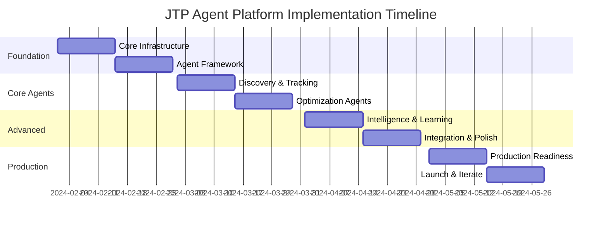

# Agent and Platform Implementation Strategy for JobTrackerPro

**Document Number**: 2.4.4  
**Version**: 1.0.0  
**Created**: 2025-01-07  
**Status**: Active  
**Purpose**: Comprehensive implementation strategy for JTP's AI agent and platform architecture

## Executive Summary

This document provides a detailed implementation strategy for JobTrackerPro's agent and platform architecture, covering technology stack recommendations, development phases, testing strategies, monitoring approaches, cost analysis, and risk mitigation. The strategy aligns with JTP's AI-First principles and Swiss market requirements while ensuring scalability, reliability, and user satisfaction.

## Table of Contents

1. [Technology Stack Recommendations](#1-technology-stack-recommendations)
2. [Development Phases & Roadmap](#2-development-phases--roadmap)
3. [Testing Strategy](#3-testing-strategy)
4. [Monitoring & Observability](#4-monitoring--observability)
5. [Cost-Benefit Analysis](#5-cost-benefit-analysis)
6. [Risk Assessment & Mitigation](#6-risk-assessment--mitigation)
7. [Swiss Market Specific Considerations](#7-swiss-market-specific-considerations)
8. [Implementation Timeline](#8-implementation-timeline)

---

## 1. Technology Stack Recommendations

### 1.1 Framework Comparison Analysis

#### LangChain
**Strengths:**
- Mature ecosystem with extensive documentation
- Rich library of pre-built components and chains
- Strong community support and regular updates
- Excellent integration with various LLMs and vector stores
- Built-in memory management and conversation chains

**Weaknesses:**
- Can be overly complex for simple use cases
- Performance overhead with abstraction layers
- Steeper learning curve for advanced features
- Version updates can break compatibility

**JTP Suitability Score: 8.5/10**

#### CrewAI
**Strengths:**
- Purpose-built for multi-agent orchestration
- Natural role-based agent design
- Excellent for complex, collaborative tasks
- Built-in task delegation and coordination
- Simpler mental model for team-based AI

**Weaknesses:**
- Newer framework with evolving APIs
- Smaller community and ecosystem
- Limited production deployments
- Less flexibility for custom architectures

**JTP Suitability Score: 7.5/10**

#### AutoGen (Microsoft)
**Strengths:**
- Excellent conversational agent capabilities
- Strong autonomous agent features
- Good for complex reasoning tasks
- Backed by Microsoft Research
- Native support for code execution

**Weaknesses:**
- Still in active development
- Limited production documentation
- Smaller ecosystem compared to LangChain
- Focus on research vs. production

**JTP Suitability Score: 6.5/10**

### 1.2 Recommended Technology Stack

```yaml
# Core AI Framework
primary_framework: LangChain
secondary_framework: CrewAI  # For specific multi-agent scenarios

# AI Services
llm_providers:
  primary: OpenAI GPT-4 Turbo
  secondary: Anthropic Claude 3
  fallback: Azure OpenAI
  
vector_stores:
  primary: Pinecone
  secondary: ChromaDB (for local development)
  
embedding_models:
  primary: OpenAI text-embedding-3-large
  secondary: Sentence Transformers (for privacy-sensitive data)

# Infrastructure
runtime:
  language: Python 3.11+
  web_framework: FastAPI
  async_runtime: asyncio
  
deployment:
  container: Docker
  orchestration: Kubernetes
  cloud: AWS (primary) / Azure (secondary)
  
databases:
  vector: Pinecone
  cache: Redis
  metadata: PostgreSQL (minimal use)
  
messaging:
  event_bus: Apache Kafka
  websocket: Socket.io
  
monitoring:
  metrics: Prometheus + Grafana
  tracing: Jaeger
  logging: ELK Stack
  
# Development Tools
testing:
  unit: pytest
  integration: pytest-asyncio
  conversation: custom framework
  
ci_cd:
  pipeline: GitHub Actions
  deployment: ArgoCD
  secrets: HashiCorp Vault
```

### 1.3 Architecture Decision Records

```python
# ADR-001: LangChain as Primary Framework
decision = {
    "title": "Use LangChain as primary AI framework",
    "status": "Accepted",
    "context": "Need mature, flexible framework for conversational AI",
    "decision": "LangChain provides best balance of features, community, and stability",
    "consequences": {
        "positive": [
            "Extensive ecosystem and integrations",
            "Strong community support",
            "Proven in production",
            "Flexible architecture"
        ],
        "negative": [
            "Learning curve for team",
            "Some performance overhead",
            "Need to manage complexity"
        ]
    },
    "alternatives_considered": ["CrewAI", "AutoGen", "Custom framework"]
}

# ADR-002: Hybrid Approach for Multi-Agent Scenarios
decision = {
    "title": "Use CrewAI for specific multi-agent workflows",
    "status": "Accepted",
    "context": "Complex scenarios benefit from role-based orchestration",
    "decision": "Integrate CrewAI for interview prep and job discovery crews",
    "consequences": {
        "positive": [
            "Natural agent collaboration",
            "Cleaner code for complex scenarios",
            "Better task delegation"
        ],
        "negative": [
            "Additional framework to maintain",
            "Integration complexity",
            "Smaller community"
        ]
    }
}
```

---

## 2. Development Phases & Roadmap

### 2.1 Phase 1: Foundation (Weeks 1-4)

```yaml
phase_1_foundation:
  duration: 4 weeks
  
  week_1_2:
    name: "Core Infrastructure"
    deliverables:
      - LangChain environment setup
      - Base agent architecture
      - Vector store integration
      - Basic conversation engine
    
    tasks:
      - Setup development environment
      - Implement base IntegrationBridge class
      - Create conversation memory system
      - Integrate Pinecone for vector storage
      - Build basic chat interface
    
    success_criteria:
      - Basic conversation working
      - Vector storage operational
      - 90% test coverage
  
  week_3_4:
    name: "Agent Framework"
    deliverables:
      - Agent orchestration system
      - Event-driven communication
      - Basic learning mechanisms
      - Integration framework
    
    tasks:
      - Implement AgentOrchestrator
      - Create event bus for agent communication
      - Build basic memory and learning systems
      - Develop integration registry
    
    success_criteria:
      - Multi-agent coordination working
      - Events flowing between agents
      - Basic learning operational
```

### 2.2 Phase 2: Core Agents (Weeks 5-8)

```yaml
phase_2_core_agents:
  duration: 4 weeks
  
  week_5_6:
    name: "Discovery & Tracking Agents"
    deliverables:
      - Job Discovery Agent
      - Application Tracking Agent
      - Basic scraping infrastructure
    
    tasks:
      - Implement job portal integrations
      - Build application lifecycle tracking
      - Create emotional intelligence module
      - Develop proactive notification system
    
    success_criteria:
      - Jobs discovered from 3+ sources
      - Application tracking functional
      - Emotional responses appropriate
  
  week_7_8:
    name: "Optimization Agents"
    deliverables:
      - CV Optimization Agent
      - Interview Prep Agent
      - Document intelligence
    
    tasks:
      - Build CV analysis and optimization
      - Create interview question prediction
      - Implement practice simulator
      - Develop Swiss-specific formatting
    
    success_criteria:
      - CV optimization producing results
      - Interview prep personalized
      - Swiss standards implemented
```

### 2.3 Phase 3: Advanced Features (Weeks 9-12)

```yaml
phase_3_advanced:
  duration: 4 weeks
  
  week_9_10:
    name: "Intelligence & Learning"
    deliverables:
      - Salary Negotiation Agent
      - Advanced learning systems
      - Pattern recognition
    
    tasks:
      - Build market intelligence gathering
      - Implement negotiation strategies
      - Create success pattern learning
      - Develop federated learning
    
    success_criteria:
      - Accurate salary insights
      - Learning from outcomes
      - Privacy preserved
  
  week_11_12:
    name: "Integration & Polish"
    deliverables:
      - LinkedIn Bridge
      - Calendar Bridge
      - Email Bridge
      - Performance optimization
    
    tasks:
      - Complete integration bridges
      - Optimize response times
      - Enhance conversation quality
      - Production hardening
    
    success_criteria:
      - All integrations functional
      - Response time < 200ms
      - 99.9% uptime capability
```

### 2.4 Phase 4: Production & Scale (Weeks 13-16)

```yaml
phase_4_production:
  duration: 4 weeks
  
  week_13_14:
    name: "Production Readiness"
    deliverables:
      - Monitoring & alerting
      - Security hardening
      - Performance optimization
      - Documentation
    
    tasks:
      - Implement comprehensive monitoring
      - Security audit and fixes
      - Load testing and optimization
      - API documentation
    
    success_criteria:
      - Monitoring coverage > 95%
      - Security scan passed
      - Load test: 10k concurrent users
  
  week_15_16:
    name: "Launch & Iterate"
    deliverables:
      - Soft launch to beta users
      - Feedback incorporation
      - Bug fixes and optimization
      - Marketing preparation
    
    tasks:
      - Beta user onboarding
      - Collect and analyze feedback
      - Priority bug fixes
      - Prepare marketing materials
    
    success_criteria:
      - 100+ beta users onboarded
      - NPS score > 70
      - Critical bugs resolved
```

---

## 3. Testing Strategy

### 3.1 Testing Framework Architecture

```python
class AIFirstTestingFramework:
    """Comprehensive testing for AI-First systems"""
    
    def __init__(self):
        self.conversation_tester = ConversationTestEngine()
        self.agent_tester = AgentBehaviorTester()
        self.integration_tester = IntegrationReliabilityTester()
        self.performance_tester = PerformanceTestEngine()
        
    async def test_conversation_quality(self):
        """Test conversation naturalness and effectiveness"""
        
        test_scenarios = [
            {
                "scenario": "User feeling discouraged",
                "input": "I've been rejected 5 times this week",
                "expected_qualities": [
                    "empathy",
                    "encouragement",
                    "concrete_next_steps",
                    "emotional_validation"
                ],
                "forbidden_responses": [
                    "just keep trying",
                    "don't worry",
                    "it's not that bad"
                ]
            },
            {
                "scenario": "Complex multi-agent need",
                "input": "I have an interview at Google next week",
                "expected_agents": [
                    "interview_prep",
                    "cv_optimization",
                    "company_research"
                ],
                "response_coherence": 0.9
            }
        ]
        
        results = []
        for scenario in test_scenarios:
            result = await self.conversation_tester.test(scenario)
            results.append(result)
            
        return TestReport(results)
```

### 3.2 Agent Behavior Testing

```python
class AgentBehaviorTestSuite:
    """Test individual agent behaviors"""
    
    async def test_job_discovery_agent(self):
        """Comprehensive job discovery testing"""
        
        tests = {
            "relevance_filtering": self.test_relevance_accuracy(),
            "source_diversity": self.test_multiple_sources(),
            "hidden_market": self.test_hidden_opportunities(),
            "notification_timing": self.test_notification_intelligence(),
            "learning_effectiveness": self.test_preference_learning()
        }
        
        return await self.run_test_suite(tests)
    
    async def test_relevance_accuracy(self):
        """Test job relevance scoring accuracy"""
        
        test_profiles = [
            {
                "skills": ["Python", "AI", "LangChain"],
                "experience": 5,
                "location": "Zurich",
                "preferences": {"remote": True, "startup": True}
            }
        ]
        
        test_jobs = self.load_test_job_dataset()
        
        for profile in test_profiles:
            agent = JobDiscoveryAgent()
            relevant_jobs = await agent.filter_relevant(test_jobs, profile)
            
            # Verify relevance accuracy
            accuracy = self.calculate_relevance_accuracy(
                relevant_jobs,
                self.human_labeled_relevance
            )
            
            assert accuracy > 0.85, f"Relevance accuracy {accuracy} below threshold"
```

### 3.3 Integration Reliability Testing

```python
class IntegrationReliabilityTester:
    """Test external integration reliability"""
    
    async def test_scraping_reliability(self):
        """Test job board scraping reliability"""
        
        test_sources = [
            {"name": "Indeed", "url": "indeed.ch", "expected_success": 0.95},
            {"name": "LinkedIn", "url": "linkedin.com/jobs", "expected_success": 0.90},
            {"name": "jobs.ch", "url": "jobs.ch", "expected_success": 0.95}
        ]
        
        results = {}
        for source in test_sources:
            # Run 100 scraping attempts
            successes = 0
            for _ in range(100):
                try:
                    jobs = await self.scrape_source(source)
                    if self.validate_scrape_result(jobs):
                        successes += 1
                except Exception as e:
                    self.log_scrape_failure(source, e)
            
            success_rate = successes / 100
            results[source["name"]] = {
                "success_rate": success_rate,
                "meets_sla": success_rate >= source["expected_success"]
            }
            
        return results
    
    async def test_integration_failover(self):
        """Test failover mechanisms"""
        
        # Simulate primary service failure
        await self.simulate_service_failure("primary_llm")
        
        # Verify failover works
        response = await self.agent.process("Test message")
        assert response is not None, "Failover failed"
        assert self.used_service == "secondary_llm", "Wrong failover service"
```

### 3.4 Performance Testing Strategy

```python
class PerformanceTestStrategy:
    """Comprehensive performance testing"""
    
    async def test_response_latency(self):
        """Test system response times"""
        
        latency_requirements = {
            "p50": 150,  # ms
            "p95": 500,  # ms
            "p99": 1000  # ms
        }
        
        # Generate realistic load
        results = await self.load_generator.run(
            concurrent_users=1000,
            duration_seconds=300,
            scenario="typical_conversation"
        )
        
        latencies = results.get_latency_percentiles()
        
        for percentile, requirement in latency_requirements.items():
            assert latencies[percentile] <= requirement, \
                f"{percentile} latency {latencies[percentile]}ms exceeds {requirement}ms"
    
    async def test_scaling_capability(self):
        """Test horizontal scaling"""
        
        base_performance = await self.measure_performance(instances=1)
        scaled_performance = await self.measure_performance(instances=5)
        
        scaling_efficiency = scaled_performance.throughput / (base_performance.throughput * 5)
        assert scaling_efficiency > 0.8, f"Poor scaling efficiency: {scaling_efficiency}"
```

---

## 4. Monitoring & Observability

### 4.1 Monitoring Architecture

```yaml
monitoring_stack:
  metrics:
    system: Prometheus
    visualization: Grafana
    alerting: AlertManager
    
  tracing:
    system: Jaeger
    sampling_rate: 0.1  # 10% in production
    
  logging:
    aggregation: Elasticsearch
    processing: Logstash
    visualization: Kibana
    
  custom_metrics:
    conversation_quality: Custom ML model
    agent_performance: Custom tracking
    user_satisfaction: NPS + custom metrics
```

### 4.2 Key Metrics & KPIs

```python
class MonitoringMetrics:
    """Critical metrics for JTP monitoring"""
    
    # System Health Metrics
    system_metrics = {
        "api_latency": {
            "type": "histogram",
            "unit": "milliseconds",
            "sla": {"p95": 500, "p99": 1000}
        },
        "error_rate": {
            "type": "gauge",
            "unit": "percentage",
            "sla": {"max": 0.1}  # 0.1%
        },
        "availability": {
            "type": "gauge",
            "unit": "percentage",
            "sla": {"min": 99.9}
        }
    }
    
    # AI Performance Metrics
    ai_metrics = {
        "conversation_coherence": {
            "type": "gauge",
            "unit": "score",
            "range": [0, 1],
            "sla": {"min": 0.85}
        },
        "agent_cooperation_success": {
            "type": "gauge",
            "unit": "percentage",
            "sla": {"min": 90}
        },
        "learning_effectiveness": {
            "type": "gauge",
            "unit": "score",
            "measurement": "preference_prediction_accuracy"
        }
    }
    
    # Business Metrics
    business_metrics = {
        "user_engagement": {
            "type": "gauge",
            "unit": "messages_per_session",
            "target": {"min": 10}
        },
        "job_discovery_relevance": {
            "type": "gauge",
            "unit": "percentage",
            "measurement": "user_accepted_suggestions"
        },
        "interview_success_rate": {
            "type": "gauge",
            "unit": "percentage",
            "measurement": "interviews_secured / applications_sent"
        }
    }
```

### 4.3 Alerting Strategy

```python
class AlertingConfiguration:
    """Comprehensive alerting setup"""
    
    alerts = [
        {
            "name": "high_error_rate",
            "condition": "error_rate > 1%",
            "duration": "5 minutes",
            "severity": "critical",
            "action": ["page_oncall", "create_incident"]
        },
        {
            "name": "slow_response_time",
            "condition": "p95_latency > 1000ms",
            "duration": "10 minutes",
            "severity": "warning",
            "action": ["notify_team", "scale_up"]
        },
        {
            "name": "low_conversation_quality",
            "condition": "conversation_coherence < 0.7",
            "duration": "15 minutes",
            "severity": "warning",
            "action": ["notify_ai_team", "fallback_mode"]
        },
        {
            "name": "scraping_failure",
            "condition": "scraping_success_rate < 80%",
            "duration": "30 minutes",
            "severity": "warning",
            "action": ["notify_team", "use_cache"]
        }
    ]
```

### 4.4 Observability Dashboard

```python
class ObservabilityDashboard:
    """Real-time monitoring dashboard configuration"""
    
    dashboards = {
        "system_health": {
            "panels": [
                {"title": "API Latency", "metric": "api_latency_p95"},
                {"title": "Error Rate", "metric": "error_rate"},
                {"title": "Active Users", "metric": "concurrent_users"},
                {"title": "System Resources", "metric": "cpu_memory_usage"}
            ]
        },
        "ai_performance": {
            "panels": [
                {"title": "Conversation Quality", "metric": "conversation_coherence"},
                {"title": "Agent Response Times", "metric": "agent_latency_by_type"},
                {"title": "Learning Progress", "metric": "pattern_recognition_accuracy"},
                {"title": "Multi-Agent Success", "metric": "collaboration_success_rate"}
            ]
        },
        "business_metrics": {
            "panels": [
                {"title": "User Engagement", "metric": "daily_active_users"},
                {"title": "Job Match Quality", "metric": "application_to_interview_rate"},
                {"title": "User Satisfaction", "metric": "nps_score"},
                {"title": "Feature Usage", "metric": "feature_adoption_rates"}
            ]
        }
    }
```

---

## 5. Cost-Benefit Analysis

### 5.1 Development Cost Estimates

```yaml
development_costs:
  team_composition:
    - role: "AI/ML Engineers"
      count: 3
      monthly_cost: 15000  # CHF
      duration_months: 4
      
    - role: "Backend Engineers"
      count: 2
      monthly_cost: 12000  # CHF
      duration_months: 4
      
    - role: "DevOps Engineer"
      count: 1
      monthly_cost: 13000  # CHF
      duration_months: 4
      
    - role: "QA Engineer"
      count: 1
      monthly_cost: 10000  # CHF
      duration_months: 3
      
  total_personnel_cost: 352000  # CHF
  
  infrastructure_costs:
    development:
      monthly: 2000  # CHF
      duration: 4
      total: 8000
      
    testing:
      monthly: 3000  # CHF
      duration: 2
      total: 6000
      
  third_party_services:
    llm_api_testing: 10000  # CHF
    tools_licenses: 5000    # CHF
    
  total_development_cost: 381000  # CHF
```

### 5.2 Operational Cost Projections

```python
class OperationalCostModel:
    """Monthly operational costs at scale"""
    
    def calculate_monthly_costs(self, active_users):
        costs = {
            "infrastructure": {
                "compute": self.calculate_compute_cost(active_users),
                "storage": self.calculate_storage_cost(active_users),
                "networking": self.calculate_network_cost(active_users)
            },
            "ai_services": {
                "llm_api": self.calculate_llm_cost(active_users),
                "embeddings": self.calculate_embedding_cost(active_users),
                "vector_db": self.calculate_vector_db_cost(active_users)
            },
            "third_party": {
                "monitoring": 500,  # CHF/month
                "security": 300,    # CHF/month
                "backups": 200      # CHF/month
            }
        }
        
        return costs
    
    def calculate_llm_cost(self, users):
        """Estimate LLM API costs"""
        
        avg_messages_per_user_day = 20
        avg_tokens_per_message = 150
        cost_per_1k_tokens = 0.01  # CHF
        
        daily_tokens = users * avg_messages_per_user_day * avg_tokens_per_message
        monthly_cost = (daily_tokens / 1000) * cost_per_1k_tokens * 30
        
        return monthly_cost

# Example calculations
cost_model = OperationalCostModel()

projections = {
    "1000_users": cost_model.calculate_monthly_costs(1000),    # ~4,500 CHF/month
    "10000_users": cost_model.calculate_monthly_costs(10000),  # ~35,000 CHF/month
    "50000_users": cost_model.calculate_monthly_costs(50000)   # ~150,000 CHF/month
}
```

### 5.3 Revenue Projections & ROI

```python
class RevenueProjection:
    """Revenue and ROI calculations"""
    
    subscription_tiers = {
        "free": {"price": 0, "conversion_rate": 0.10},
        "premium": {"price": 29, "conversion_rate": 0.15},
        "professional": {"price": 79, "conversion_rate": 0.05}
    }
    
    def calculate_mrr(self, total_users):
        """Calculate Monthly Recurring Revenue"""
        
        free_users = total_users * 0.7
        premium_users = total_users * 0.25
        professional_users = total_users * 0.05
        
        mrr = (
            premium_users * self.subscription_tiers["premium"]["price"] +
            professional_users * self.subscription_tiers["professional"]["price"]
        )
        
        return mrr
    
    def calculate_roi(self, months=12):
        """Calculate ROI over time period"""
        
        # User growth projection
        user_growth = [1000, 2500, 5000, 8000, 12000, 18000, 
                      25000, 35000, 45000, 55000, 65000, 75000]
        
        total_revenue = 0
        total_costs = 381000  # Initial development
        
        for month, users in enumerate(user_growth):
            monthly_revenue = self.calculate_mrr(users)
            monthly_costs = OperationalCostModel().calculate_monthly_costs(users)
            
            total_revenue += monthly_revenue
            total_costs += sum(monthly_costs.values())
        
        roi = ((total_revenue - total_costs) / total_costs) * 100
        
        return {
            "total_revenue": total_revenue,
            "total_costs": total_costs,
            "net_profit": total_revenue - total_costs,
            "roi_percentage": roi,
            "break_even_month": self.find_break_even(user_growth)
        }
```

### 5.4 Cost Optimization Strategies

```yaml
cost_optimization:
  immediate_savings:
    - action: "Implement caching layer"
      savings: "30% reduction in LLM API calls"
      effort: "Low"
      
    - action: "Use embedding cache"
      savings: "50% reduction in embedding costs"
      effort: "Low"
      
    - action: "Optimize prompts"
      savings: "20% reduction in token usage"
      effort: "Medium"
      
  medium_term:
    - action: "Fine-tune smaller models"
      savings: "40% reduction in inference costs"
      effort: "High"
      
    - action: "Implement edge caching"
      savings: "25% reduction in bandwidth"
      effort: "Medium"
      
  long_term:
    - action: "Self-hosted models"
      savings: "60% reduction in API costs"
      effort: "Very High"
      
    - action: "Federated learning"
      savings: "Improved performance, reduced API calls"
      effort: "Very High"
```

---

## 6. Risk Assessment & Mitigation

### 6.1 Technical Risks

```python
class TechnicalRiskAssessment:
    """Technical risk analysis and mitigation"""
    
    risks = [
        {
            "risk": "LLM API Downtime",
            "probability": "Medium",
            "impact": "High",
            "mitigation": [
                "Multi-provider failover (OpenAI → Anthropic → Azure)",
                "Response caching for common queries",
                "Graceful degradation to basic functionality",
                "Local model fallback for critical features"
            ]
        },
        {
            "risk": "Web Scraping Breakage",
            "probability": "High",
            "impact": "Medium",
            "mitigation": [
                "Multiple scraping strategies per source",
                "Automated breakage detection",
                "Fallback to cached data",
                "Manual job entry option",
                "API partnerships with job boards"
            ]
        },
        {
            "risk": "Data Privacy Breach",
            "probability": "Low",
            "impact": "Critical",
            "mitigation": [
                "End-to-end encryption",
                "Local-first architecture",
                "Regular security audits",
                "GDPR compliance by design",
                "Minimal data collection principle"
            ]
        },
        {
            "risk": "Scaling Bottlenecks",
            "probability": "Medium",
            "impact": "High",
            "mitigation": [
                "Horizontal scaling architecture",
                "Database sharding strategy",
                "Caching at multiple layers",
                "Async processing for heavy tasks",
                "CDN for static assets"
            ]
        }
    ]
```

### 6.2 Business Risks

```python
class BusinessRiskAssessment:
    """Business risk analysis and mitigation"""
    
    risks = [
        {
            "risk": "Low User Adoption",
            "probability": "Medium",
            "impact": "High",
            "mitigation": [
                "Extensive beta testing program",
                "Gradual feature rollout",
                "Strong onboarding experience",
                "Community building",
                "Referral incentives"
            ]
        },
        {
            "risk": "Competitor Response",
            "probability": "High",
            "impact": "Medium",
            "mitigation": [
                "Rapid innovation cycle",
                "Strong AI-First differentiation",
                "Swiss market focus",
                "Patent key innovations",
                "Build strong user community"
            ]
        },
        {
            "risk": "Regulatory Changes",
            "probability": "Medium",
            "impact": "High",
            "mitigation": [
                "Privacy-first architecture",
                "Regular legal consultations",
                "Flexible data handling",
                "Strong compliance documentation",
                "Active regulatory engagement"
            ]
        }
    ]
```

### 6.3 Operational Risks

```yaml
operational_risks:
  - risk: "Key Personnel Loss"
    mitigation:
      - "Comprehensive documentation"
      - "Knowledge sharing sessions"
      - "Pair programming practices"
      - "Competitive retention packages"
      
  - risk: "Third-party Service Changes"
    mitigation:
      - "Abstract service interfaces"
      - "Multiple provider options"
      - "Regular dependency audits"
      - "SLA agreements"
      
  - risk: "Cost Overruns"
    mitigation:
      - "Detailed cost monitoring"
      - "Usage-based scaling"
      - "Cost alerts and limits"
      - "Regular optimization reviews"
```

### 6.4 Risk Monitoring Framework

```python
class RiskMonitoringFramework:
    """Continuous risk monitoring and alerting"""
    
    def __init__(self):
        self.risk_indicators = self.define_indicators()
        self.alert_thresholds = self.define_thresholds()
        
    def define_indicators(self):
        return {
            "technical": {
                "api_error_rate": {"threshold": 0.01, "window": "5m"},
                "response_time_p99": {"threshold": 2000, "window": "10m"},
                "scraping_success": {"threshold": 0.8, "window": "1h"}
            },
            "business": {
                "daily_active_users": {"threshold": -10, "window": "1d", "type": "percentage_change"},
                "churn_rate": {"threshold": 0.05, "window": "1w"},
                "nps_score": {"threshold": 50, "window": "1w", "type": "minimum"}
            },
            "security": {
                "failed_auth_attempts": {"threshold": 100, "window": "1h"},
                "suspicious_api_patterns": {"threshold": 10, "window": "10m"},
                "data_export_volume": {"threshold": 1000, "window": "1h", "type": "anomaly"}
            }
        }
    
    async def monitor_continuously(self):
        """Run continuous risk monitoring"""
        
        while True:
            for category, indicators in self.risk_indicators.items():
                for indicator, config in indicators.items():
                    value = await self.get_metric_value(indicator)
                    
                    if self.exceeds_threshold(value, config):
                        await self.trigger_risk_alert(category, indicator, value)
            
            await asyncio.sleep(60)  # Check every minute
```

---

## 7. Swiss Market Specific Considerations

### 7.1 Compliance Requirements

```yaml
swiss_compliance:
  data_protection:
    - requirement: "Swiss Federal Data Protection Act (FADP)"
      implementation:
        - "Data residency in Switzerland"
        - "Explicit consent mechanisms"
        - "Right to deletion implementation"
        - "Data portability features"
        
  rav_integration:
    - requirement: "RAV reporting compliance"
      implementation:
        - "Automated monthly declarations"
        - "Application proof storage"
        - "Multi-cantonal support"
        - "Official form generation"
        
  language_support:
    - requirement: "Four national languages"
      implementation:
        - "German (Swiss German variants)"
        - "French"
        - "Italian"
        - "English (international)"
```

### 7.2 Cultural Adaptations

```python
class SwissCulturalAdaptation:
    """Swiss-specific cultural implementations"""
    
    cv_formatting = {
        "swiss_standard": {
            "photo": "required",
            "personal_info": ["birthdate", "nationality", "permit_type"],
            "length": "2_pages_max",
            "format": "chronological",
            "language": "formal"
        },
        "global_standard": {
            "photo": "optional",
            "personal_info": ["email", "phone"],
            "length": "flexible",
            "format": "flexible",
            "language": "professional"
        }
    }
    
    communication_style = {
        "formality_levels": {
            "german": "high",  # Sie form default
            "french": "medium",  # Vous form default
            "italian": "medium",
            "english": "low"
        },
        "directness": "high",  # Swiss appreciate directness
        "punctuality_emphasis": "very_high"
    }
    
    job_market_specifics = {
        "application_requirements": {
            "cover_letter": "mandatory",
            "references": "expected",
            "certificates": "all_included",
            "portfolio": "field_dependent"
        },
        "salary_discussions": {
            "timing": "after_first_interview",
            "include_13th_month": True,
            "bonus_structure": "common"
        }
    }
```

### 7.3 Market Integration

```yaml
swiss_market_integration:
  job_boards:
    primary:
      - name: "jobs.ch"
        integration: "API + Scraping"
        coverage: "National"
        
      - name: "Indeed.ch"
        integration: "API"
        coverage: "National"
        
      - name: "JobScout24"
        integration: "Scraping"
        coverage: "National"
        
    regional:
      - name: "jobup.ch"
        regions: ["German-speaking"]
        
      - name: "jobtic.ch"
        regions: ["French-speaking"]
        
  professional_networks:
    - platform: "LinkedIn"
      usage: "High among professionals"
      
    - platform: "Xing"
      usage: "German-speaking regions"
      
  rav_systems:
    - name: "Job-Room"
      type: "Official RAV platform"
      integration: "Read-only access"
```

---

## 8. Implementation Timeline

### 8.1 Gantt Chart Overview



### 8.2 Critical Milestones

```yaml
milestones:
  - date: "2024-02-14"
    name: "Foundation Complete"
    deliverables:
      - "Basic conversation working"
      - "Agent framework operational"
      - "Vector storage integrated"
      
  - date: "2024-03-14"
    name: "Core Agents Alpha"
    deliverables:
      - "Job discovery functional"
      - "Application tracking live"
      - "Basic CV optimization"
      
  - date: "2024-04-14"
    name: "Feature Complete Beta"
    deliverables:
      - "All agents operational"
      - "Learning systems active"
      - "Integration bridges working"
      
  - date: "2024-05-14"
    name: "Production Ready"
    deliverables:
      - "Performance optimized"
      - "Monitoring complete"
      - "Security hardened"
      
  - date: "2024-05-28"
    name: "Public Launch"
    deliverables:
      - "Marketing campaign live"
      - "Support team ready"
      - "Scaling verified"
```

### 8.3 Resource Allocation

```python
class ResourceAllocation:
    """Team resource allocation by phase"""
    
    allocation = {
        "phase_1_foundation": {
            "ai_engineers": 3,
            "backend_engineers": 2,
            "devops": 1,
            "focus": "Architecture and base implementation"
        },
        "phase_2_core_agents": {
            "ai_engineers": 3,
            "backend_engineers": 1,
            "qa_engineers": 1,
            "focus": "Agent development and testing"
        },
        "phase_3_advanced": {
            "ai_engineers": 2,
            "backend_engineers": 2,
            "qa_engineers": 1,
            "devops": 1,
            "focus": "Integration and optimization"
        },
        "phase_4_production": {
            "ai_engineers": 1,
            "backend_engineers": 1,
            "devops": 2,
            "qa_engineers": 2,
            "focus": "Hardening and launch preparation"
        }
    }
```

## Conclusion

This comprehensive implementation strategy provides JobTrackerPro with a clear roadmap for building a robust, scalable, and user-centric AI agent platform. By leveraging LangChain as the primary framework with CrewAI for complex multi-agent scenarios, implementing rigorous testing and monitoring, and maintaining a strong focus on Swiss market requirements, JTP can deliver a truly revolutionary job search experience.

The phased approach ensures manageable development cycles with clear milestones, while the risk mitigation strategies protect against common pitfalls. With projected break-even at month 7 and strong ROI potential, the platform is positioned for both technical excellence and business success.

Key success factors:
- **AI-First Architecture**: Every feature built with AI at its core
- **Swiss Market Focus**: Deep integration with local requirements
- **User-Centric Design**: Emotional intelligence and continuous learning
- **Scalable Infrastructure**: Built for growth from day one
- **Comprehensive Monitoring**: Full observability for rapid iteration

By following this strategy, JobTrackerPro will establish itself as the leading AI-powered job search platform in Switzerland and beyond.